# NewHuman — 类 OpenClaw 个人 AI 助手 MVP 设计文档

| 属性 | 内容 |
|------|------|
| 文档版本 | v1.3 |
| 创建日期 | 2026-06-16 |
| 文档类型 | 系统设计（SDD） |
| 项目代号 | NewHuman |
| 关联需求 | [MVP需求文档 v1.2](../0_需求文档/MVP需求文档_v1.0.md) |
| 状态 | 草案 |

---

## 1. 设计概述

本文档描述 NewHuman MVP 的**如何实现**，包括架构、流程、模块、数据、API 与工具技术方案。

**需求来源：** 所有设计项均追溯至 [需求文档](../0_需求文档/MVP需求文档_v1.0.md) 中的 `REQ-*` 编号。

### 1.1 设计原则

- **Web-only Gateway**：FastAPI 即控制平面，不单独部署 Gateway 进程
- **对齐 OpenClaw/Codex 工具面**：MVP 实现 fs 只读 + memory + 受控 exec + 网络 + KB
- **Workspace 驱动**：Bootstrap / Skills 用 Markdown，改文件即改行为
- **最小 ReAct 图**：LLM ↔ Tool 两节点 + 条件边

---

## 2. 需求追溯矩阵

| 需求 ID | 需求摘要 | 设计章节 |
|---------|----------|----------|
| REQ-001 ~ 003 | Gateway API | [§3.1](#31-gateway) |
| REQ-004 ~ 006, REQ-020 | Agent Runtime | [§3.2](#32-agent-runtime) |
| REQ-007 ~ 009, REQ-022 | Workspace / Skills | [§3.3](#33-workspace)、[§6.3](#63-workspace-与-skills-目录) |
| REQ-010 ~ 016, REQ-023, REQ-024 | Tools | [§3.5](#35-tools)、[§8.4](#84-agent-可调用工具) |
| REQ-NFR-007 | exec 安全 | [§8.4.1](#841-exec-命令行执行设计) |
| REQ-NFR-008 | 网络安全 | [§8.4.2](#842-网络访问工具设计) |
| REQ-NFR-006 | 可维护 / 模块边界 | [§6](#6-代码与文档结构) |
| REQ-017 ~ 018 | Memory | [§3.6](#36-memory) |
| REQ-019 | Knowledge Base | [§3.5](#35-tools)、[§8.7](#87-知识库文档格式) |
| REQ-021 | Sessions | [§3.7](#37-sessions) |
| REQ-NFR-* | 非功能 | [§10](#10-非功能设计) |
| REQ-ENV-* | 环境依赖 | [§8.2 ~ 8.3](#82-开发与运行环境) |

---

## 3. 系统架构

### 3.1 Gateway

**满足：** REQ-001, REQ-002, REQ-003

**职责：** HTTP 接入、任务管理、SSE 推送、会话元数据。

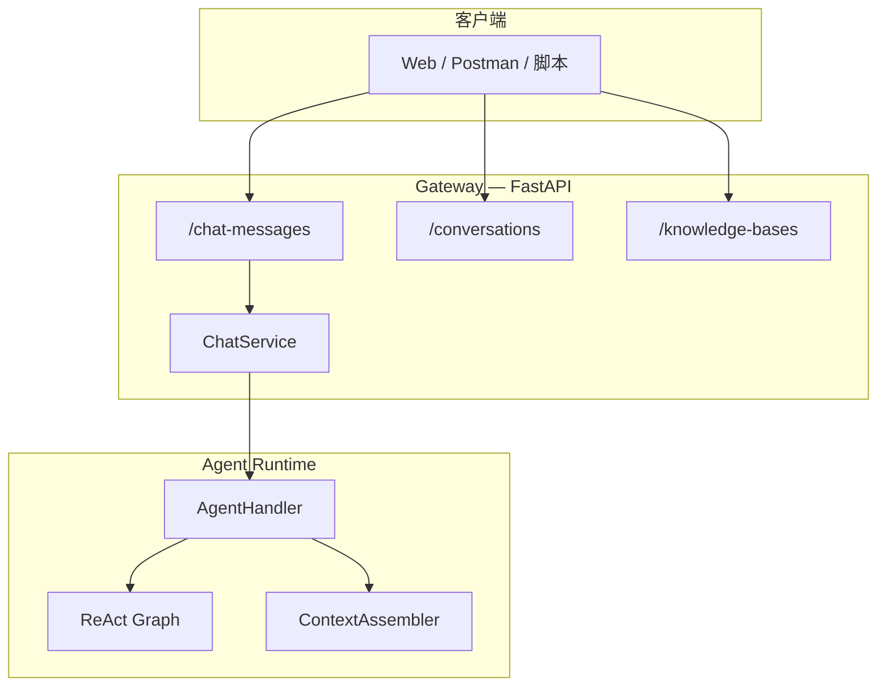

| 端点 | 文件 | 说明 |
|------|------|------|
| `POST /chat-messages` | `api/v1/chat_messages.py` | streaming / blocking |
| `POST /chat-messages/:task_id/stop` | 同上 | REQ-002 |
| `GET /conversations/:id/variables` | `api/v1/conversations.py` | REQ-003 |
| KB CRUD | `api/v1/knowledge_bases.py` | REQ-019 |

**可选新增（REQ-022）：**

| 端点 | 说明 |
|------|------|
| `POST /workspace/setup` | 初始化 workspace 模板 |
| `GET /workspace/bootstrap` | 列出 bootstrap 文件 |

### 3.2 Agent Runtime

**满足：** REQ-004, REQ-005, REQ-006, REQ-020

**实现：** `func/graph/build.py` + `agent_handler.py`

**ReAct 图：**

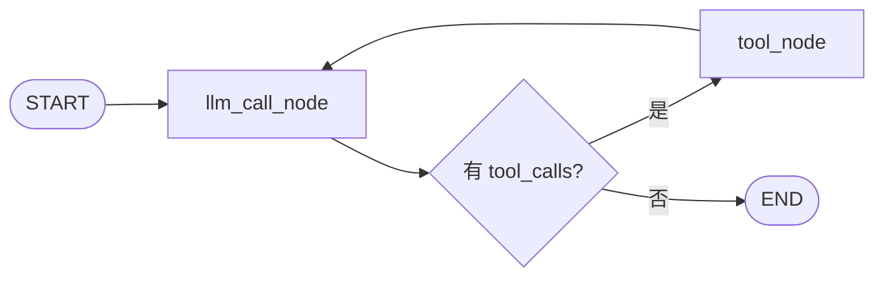

| 节点 | 输入 | 输出 |
|------|------|------|
| `llm_call` | state.messages | AIMessage（bind_tools，流式） |
| `tool_node` | tool_calls | ToolMessage[] |
| `should_continue` | 最后 AIMessage | `tools` / `end` |

**State：**

```python
class WorkflowState(TypedDict):
    messages: Annotated[list[AnyMessage], add_messages]
    query: str
    response: str
```

**调用链：** `ChatService` → `AgentHandler.stream_chat()` → `agent.astream()`，`thread_id` = `conversation_id`。

### 3.3 Workspace

**满足：** REQ-007, REQ-008

```
workspace/default/
├── AGENTS.md
├── SOUL.md
├── USER.md
├── TOOLS.md
├── MEMORY.md
├── memory/YYYY-MM-DD.md
└── skills/kb-qa/SKILL.md
```

| 文件 | 注入时机 | 截断 |
|------|----------|------|
| AGENTS / SOUL / USER / TOOLS | 新 session 首轮 | >8KB 截断 |
| MEMORY.md | 不自动注入 | 经 memory tool |
| BOOTSTRAP.md | 仅首次部署 | 完成后删除 |

### 3.4 Skills

**满足：** REQ-009

- 来源：`workspace/default/skills/`
- Prompt 只注入 `{name, description, path}` 列表
- 全文通过 `read_file` 按需加载

### 3.5 Tools

**满足：** REQ-010 ~ REQ-016, REQ-023, REQ-024, REQ-NFR-007, REQ-NFR-008

**Tool Policy 摘要：**

```yaml
tools:
  allow: [read_file, list_dir, memory_search, memory_get, memory_append, search_knowledge, exec, web_search, web_fetch]
  deny: [write_file, edit_file, apply_patch]
```

**`exec`（REQ-023）：** workspace cwd、超时、deny；**禁止 curl/wget**，联网走 web 工具。

**`web_search` / `web_fetch`（REQ-024）：** 见 [§8.4.2](#842-网络访问工具设计)。

### 3.6 Memory

**满足：** REQ-017, REQ-018

| 层级 | 实现 |
|------|------|
| 短期 | LangGraph MemorySaver，`thread_id` = `conversation_id` |
| 长期 | MEMORY.md + memory/；`memory_*` tools |

### 3.7 Sessions

**满足：** REQ-021

| 概念 | 实现 |
|------|------|
| Session ID | `conversation_id`（客户端传或 API 生成 UUID） |
| thread 映射 | LangGraph `configurable.thread_id` |
| 元数据 | conversations 表 + checkpoint |

### 3.8 OpenClaw 模块映射

| OpenClaw | NewHuman MVP | 状态 |
|----------|--------------|------|
| Gateway | FastAPI | 已有 |
| Agent Runtime | LangGraph | 待实现图 |
| Workspace | `workspace/default/` | 待建 |
| Tools + Policy | `func/graph/tools/*` | 部分 |
| Memory | checkpoint + MEMORY.md | 待建 |
| Channels | — | 跳过 |

### 3.9 部署架构

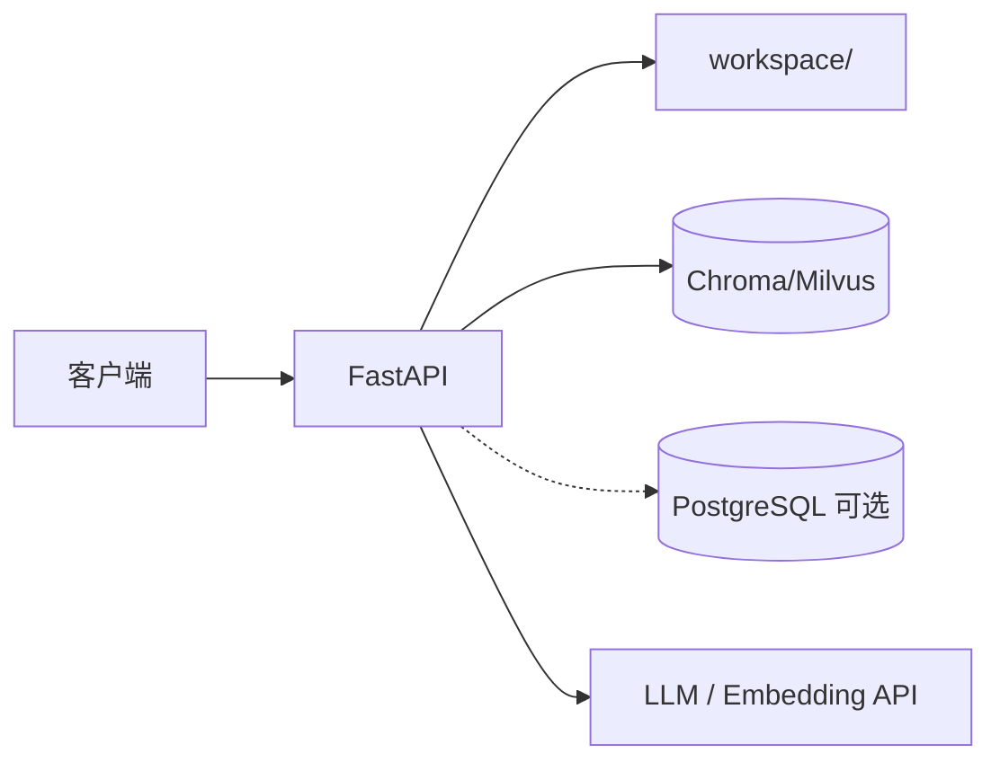

MVP：内存 checkpoint + SQLite + Chroma。

---

## 4. 核心流程

### 4.1 对话主流程（Streaming）

**满足：** REQ-001, REQ-004, REQ-006

```mermaid
sequenceDiagram
    autonumber
    participant C as 客户端
    participant G as ChatService
    participant H as AgentHandler
    participant A as ContextAssembler
    participant L as LangGraph
    participant M as LLM
    participant T as Tools
    participant K as Checkpoint

    C->>G: POST /chat-messages
    G->>H: stream_chat
    H->>A: assemble context
    H->>L: astream
    L->>K: 读历史
    L->>M: llm_call
    alt tool_calls
        M-->>L: AIMessage + tools
        L->>T: execute
        T-->>L: ToolMessage
        L->>M: 再推理
    end
    loop SSE
        L-->>H-->>G-->>C: chunk
    end
    L->>K: persist
```

### 4.2 Context 组装

**满足：** REQ-008, REQ-009

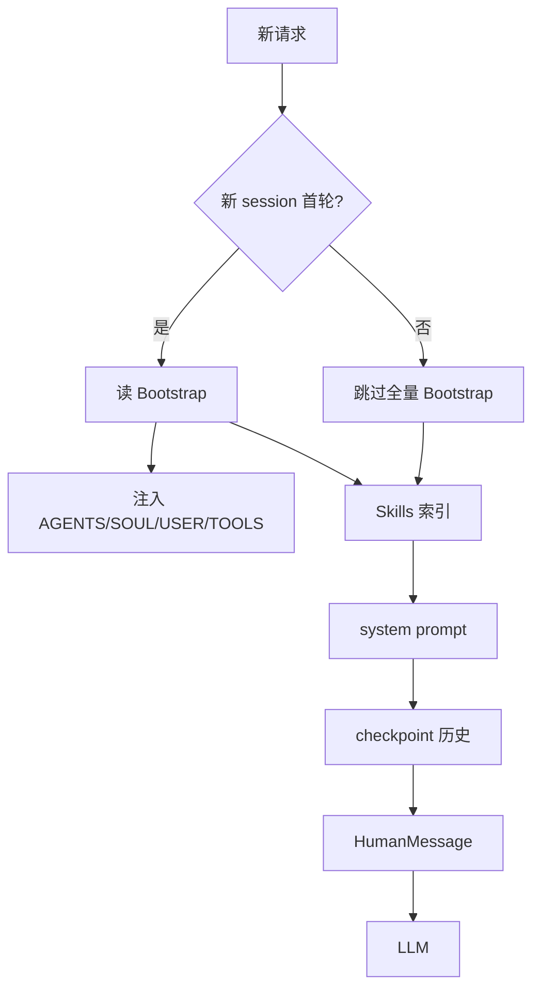

### 4.3 知识库 RAG

**满足：** REQ-015, REQ-019

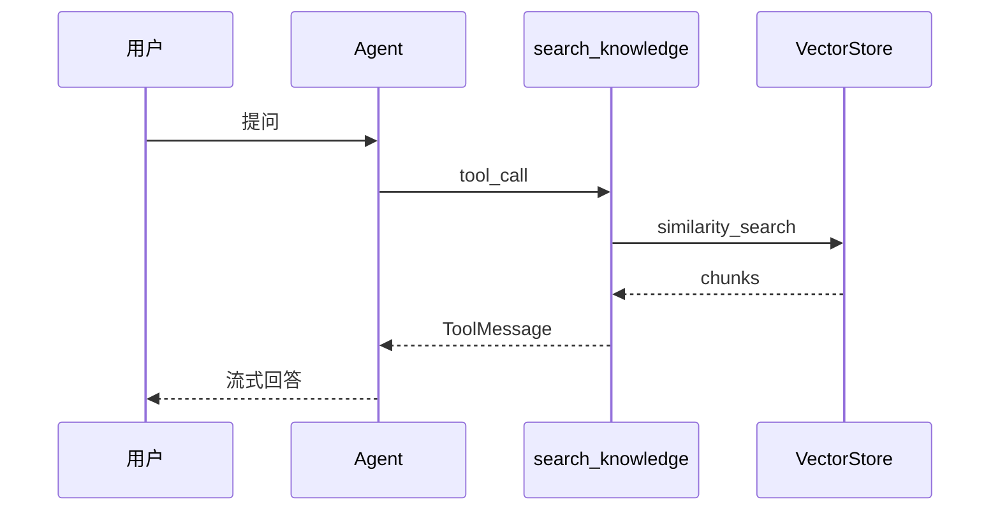

### 4.4 Workspace 初始化

**满足：** REQ-022

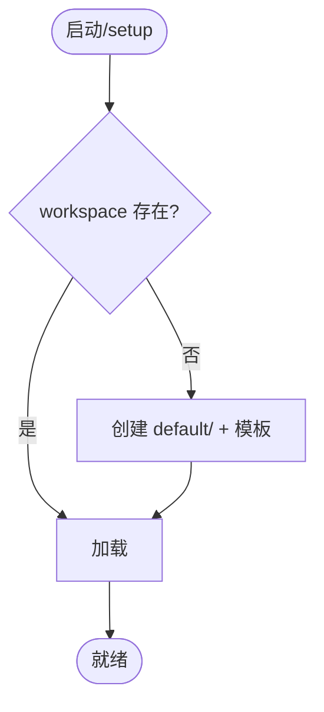

---

## 5. UML 设计

### 5.1 领域类图

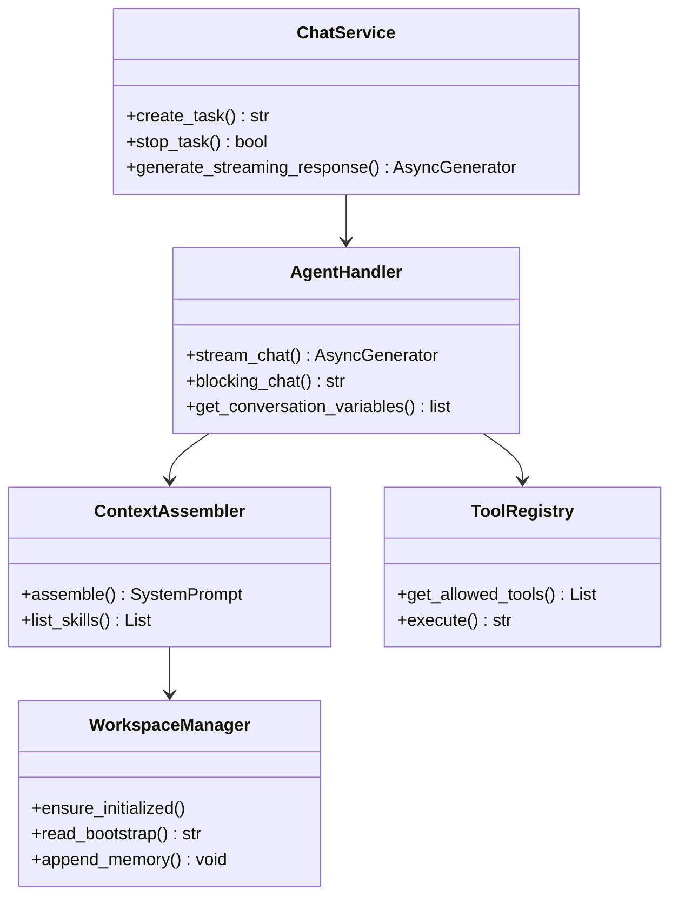

### 5.2 组件图

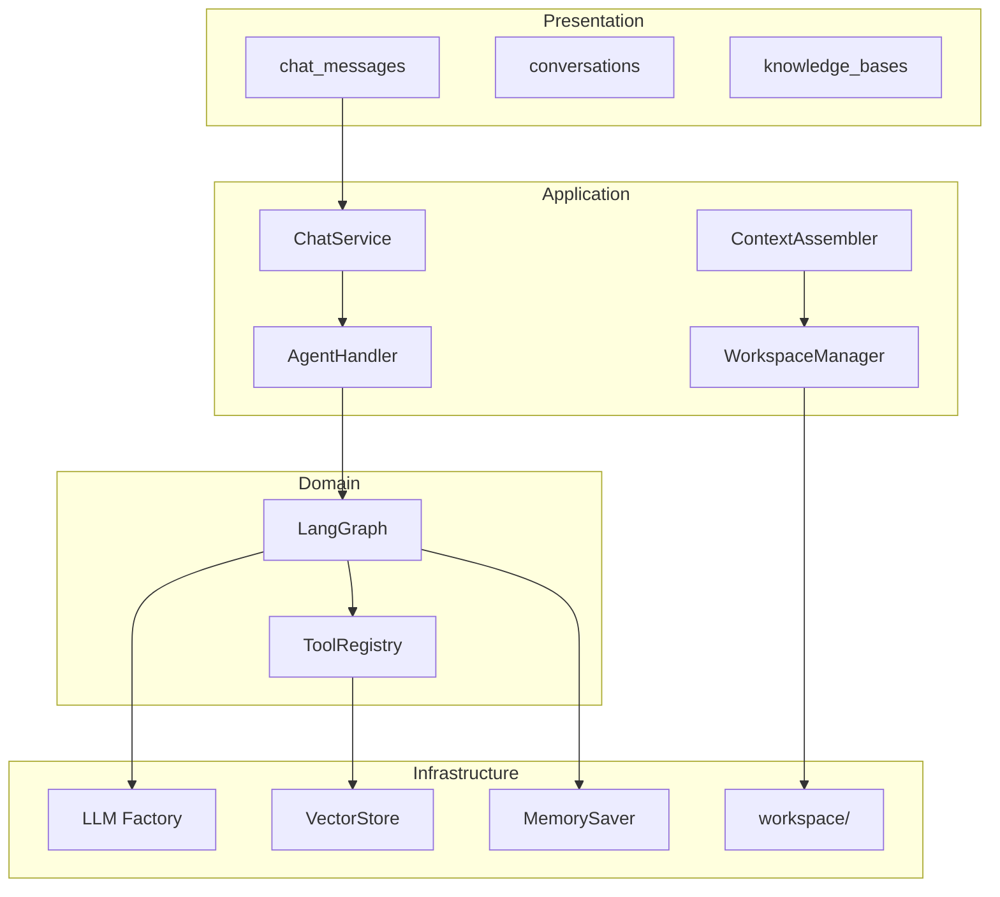

### 5.3 Agent 状态机

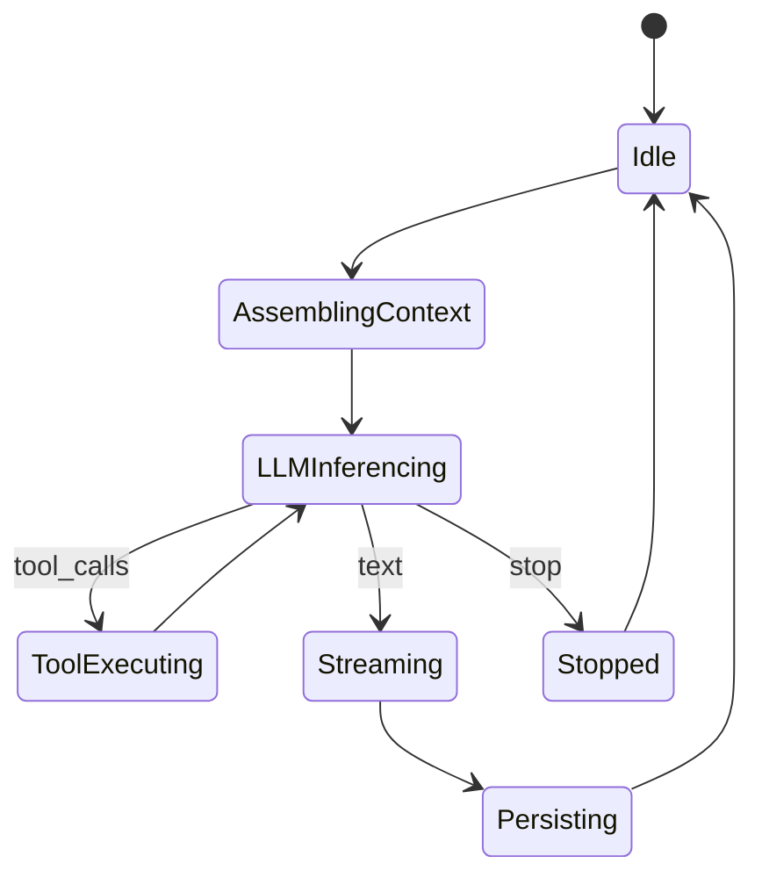

---

## 6. 代码与文档结构

本章定义仓库目录、后端分层、Agent 子系统包结构、文档体系及模块依赖规则，满足 **REQ-NFR-006**（模块边界清晰、可维护）。

### 6.1 仓库顶层结构

```
NewHuman/
├── README.md                      # 项目总览与快速启动
├── code/                          # 后端 Python 应用（工作目录：code/app）
│   ├── README.md
│   ├── pyproject.toml / uv.lock
│   ├── requirements.txt
│   └── app/                       # FastAPI 应用根包
├── docs/                          # 项目文档（与代码分离）
│   ├── 0_需求文档/                # PRD、REQ 列表
│   ├── 1_设计文档/                # SDD、架构与本文档
│   └── 2_开发文档/                # 开发规范、接口约定
├── workspace/                     # 【MVP 新增】Agent 运行时工作区（git 可忽略 data）
│   └── default/                   # 单 Agent 默认 workspace
├── others/                        # Postman 集合、workflow 等非代码资产
└── data/                          # 【运行时】SQLite、Chroma 持久化（建议 .gitignore）
```

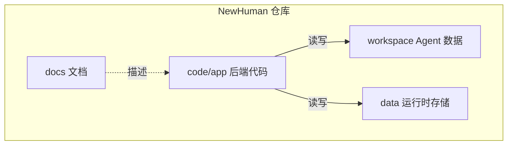

### 6.2 后端分层结构（`code/app/`）

采用 **API → Service → Domain(Func) → Infrastructure** 四层，Gateway 不直接调用数据库或 LLM。

```
code/app/
├── main.py                        # 应用入口、路由注册、lifespan
├── .env / .env.demo               # 环境变量模板
│
├── api/v1/                        # 【表示层】HTTP 路由，仅做参数校验与响应封装
│   ├── chat_messages.py           # REQ-001, REQ-002
│   ├── conversations.py           # REQ-003, REQ-021
│   └── knowledge_bases.py         # REQ-019
│
├── service/                       # 【应用层】业务编排，不含 LangGraph 细节
│   ├── chat_messages_service.py   # 任务管理、SSE 事件封装
│   ├── conversations_service.py
│   └── knowledge_base_service.py
│
├── func/                          # 【领域层】核心能力
│   ├── graph/                     # Agent Runtime（见 §6.4）
│   └── kb_system_langchain/      # 知识库子系统（已有）
│
├── schema/                        # 【DTO】Pydantic 请求/响应模型
│   ├── chat_messages_model.py
│   ├── conversations_model.py
│   └── knowledge_base_model.py
│
├── config/                        # 【配置】环境变量读取
│   ├── llm_config.py
│   ├── emb_config.py
│   ├── database_config.py
│   ├── vectordb_config.py
│   └── service_config.py
│
├── utils/                         # 【基础设施】LLM / Embedding 工厂与算子
│   ├── llm/
│   └── embedding/
│
├── database/                      # 【基础设施】ORM、会话
│   └── orm/
│
├── core/                          # 【基础设施】Nacos 等横切能力
│   └── nacos.py
│
└── demo/                          # 本地试验脚本（非生产路径）
```

**分层依赖规则（只允许向下依赖）：**

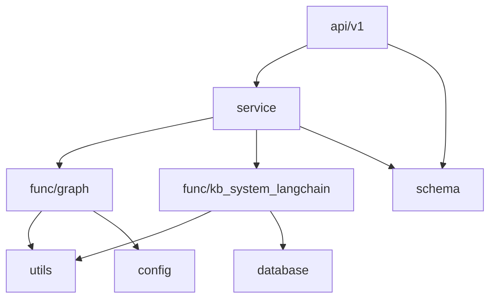

| 规则 | 说明 |
|------|------|
| `api` 不 import `func/graph/build` | 必须经过 `service` 或 `agent_handler` |
| `func/graph` 不 import `api` | 领域层与 HTTP 解耦 |
| `tools` 不 import `service` | 工具保持纯函数/可测试 |
| 配置统一走 `config/*.py` | 禁止在业务代码中散落 `os.getenv` |

### 6.3 Workspace 与 Skills 目录

**满足：** REQ-007, REQ-009, REQ-022

运行时 Workspace **位于仓库根** `workspace/default/`（可通过 `WORKSPACE_ROOT` 环境变量覆盖），与 `code/app` 代码分离。

```
workspace/default/
├── AGENTS.md
├── SOUL.md
├── USER.md
├── TOOLS.md
├── MEMORY.md
├── memory/
│   └── YYYY-MM-DD.md
└── skills/
    └── kb-qa/
        └── SKILL.md
```

| 类型 | 位置 | 版本管理建议 |
|------|------|--------------|
| Bootstrap 模板 | `workspace/default/*.md` | 可提交示例模板 |
| 用户记忆 / 日志 | `MEMORY.md`, `memory/` | 加入 `.gitignore` 或单独 data 目录 |
| Skills | `skills/*/SKILL.md` | 模板可提交，用户扩展可选忽略 |

### 6.4 Agent 子系统结构（`func/graph/`）

**满足：** REQ-004 ~ 006, REQ-010 ~ 024

当前仓库已有骨架；下表标明 **已有** 与 **MVP 待建** 文件。

```
func/graph/
├── build.py                 # [已有] 编译 LangGraph；MVP 补全 ReAct 节点与边
├── agent_handler.py         # [已有] Gateway ↔ Agent 桥接
├── run.py                   # [已有] 本地调试入口
├── show_graph.py            # [已有] 图可视化
│
├── state/                   # [已有] LangGraph State
│   ├── base.py              # MessagesStateBase
│   └── state.py             # WorkflowState
│
├── params/                  # [已有] 图参数/提示词配置
│   └── params.py
│
├── nodes/                   # 【MVP 新增】图节点
│   ├── llm_call.py          # bind_tools + 流式 LLM
│   └── tool_node.py         # 执行 ToolRegistry
│
├── edges/                   # 【MVP 新增】条件边
│   └── should_continue.py   # tool_calls ? tools : end
│
├── workspace/               # 【MVP 新增】Workspace 与 Context
│   ├── manager.py           # 初始化、读 bootstrap、路径校验
│   └── context_assembler.py # 组装 system prompt + skills 索引
│
└── tools/                   # Agent 可调用工具
    ├── tool_used.py         # [已有] 工具注册入口；MVP 扩展 allow/deny
    ├── tool_registry.py     # 【MVP 新增】策略过滤、统一 execute
    ├── file_tool.py         # 【MVP 新增】read_file, list_dir
    ├── memory_tool.py       # 【MVP 新增】memory_search/get/append
    ├── web_tool.py          # 【MVP 新增】web_search, web_fetch
    ├── terminal_tool.py     # [已有] 重构为 exec
    ├── vectorstore_tool.py  # [已有] search_knowledge
    └── calculator_tool.py   # [已有] 演示用，MVP 默认不注册
```

**MVP 新增模块职责：**

| 模块 | 文件 | 职责 |
|------|------|------|
| 图节点 | `nodes/llm_call.py` | 调用 `LLMFactory`，绑定 `ToolRegistry.get_allowed()` |
| 图节点 | `nodes/tool_node.py` | 解析 tool_calls，写回 ToolMessage |
| 条件边 | `edges/should_continue.py` | 判断最后 AIMessage 是否含 tool_calls |
| Workspace | `workspace/manager.py` | `ensure_initialized()`、安全读文件 |
| Context | `workspace/context_assembler.py` | 新 session 注入 Bootstrap + skills 列表 |
| 工具注册 | `tools/tool_registry.py` | 加载 policy yaml，过滤 allow/deny |

### 6.5 配置与策略文件（MVP 新增）

```
code/app/config/
├── tools_policy.yaml          # 【建议新增】allow/deny、exec/web 沙箱参数
└── workspace_config.py        # 【建议新增】WORKSPACE_ROOT 等
```

与 `.env` 分工：

| 文件 | 内容 |
|------|------|
| `.env` | 密钥、URL、模型名（不进 git） |
| `config/*_config.py` | 读取 `.env` 的 Python 配置类 |
| `tools_policy.yaml` | 工具策略（可进 git，无密钥） |

### 6.6 文档体系结构

```
docs/
├── 0_需求文档/
│   ├── README.md
│   └── MVP需求文档_v1.0.md      # REQ-* 唯一来源
├── 1_设计文档/
│   ├── README.md
│   └── MVP设计文档_v1.0.md      # 本文档：架构 + 代码结构
└── 2_开发文档/
    └── 1_开发规范.md            # Git、Commit、接口规范
```

| 文档类型 | 目录 | 维护时机 |
|----------|------|----------|
| 需求（What） | `0_需求文档/` | 功能范围、验收标准变更时 |
| 设计（How） | `1_设计文档/` | 架构、目录、接口契约变更时 |
| 规范（How to work） | `2_开发文档/` | 团队协作约定变更时 |
| API 联调 | `others/postman/` | 端点变更时同步集合 |

**代码与文档对应关系：**

| 代码路径 | 设计文档章节 | 需求文档 |
|----------|--------------|----------|
| `api/v1/chat_messages.py` | §3.1, §9 | REQ-001~002 |
| `func/graph/build.py` | §3.2, §4 | REQ-004~005 |
| `func/graph/workspace/` | §6.3, §6.4 | REQ-007~008 |
| `func/graph/tools/` | §8.4 | REQ-010~024 |
| `func/kb_system_langchain/` | §8.7 | REQ-019 |
| `workspace/default/` | §6.3, §7.1 | REQ-007, REQ-009 |

### 6.7 命名与文件约定

| 类别 | 约定 | 示例 |
|------|------|------|
| API 路由 | `api/v1/{资源}.py`，router prefix 复数 | `chat_messages.py` → `/chat-messages` |
| Service | `{领域}_service.py`，类名 `{领域}Service` | `ChatService` |
| LangGraph 节点 | `nodes/{动作}.py`，函数与节点同名 | `llm_call` |
| Tool | `{功能}_tool.py`，`@tool` 名与 OpenClaw 对齐 | `read_file`, `exec` |
| State | `state/{name}.py`，TypedDict | `WorkflowState` |
| 配置类 | `{域}_config.py`，继承 `BaseConfig` | `LLMConfig` |
| Schema | `schema/{资源}_model.py` | `ChatMessageRequest` |

### 6.8 需求 → 代码落点速查

| 需求 | 主要落点文件 |
|------|--------------|
| REQ-001~002 | `api/v1/chat_messages.py`, `service/chat_messages_service.py` |
| REQ-004~005 | `func/graph/build.py`, `nodes/llm_call.py`, `edges/should_continue.py` |
| REQ-006, REQ-021 | `agent_handler.py`, `state/state.py`, checkpoint config |
| REQ-007~008 | `workspace/manager.py`, `workspace/context_assembler.py` |
| REQ-010~011 | `tools/file_tool.py` |
| REQ-012~014 | `tools/memory_tool.py` |
| REQ-015 | `tools/vectorstore_tool.py` |
| REQ-023 | `tools/terminal_tool.py` → `exec` |
| REQ-024 | `tools/web_tool.py` |
| REQ-016, REQ-NFR-007/008 | `tools/tool_registry.py`, `config/tools_policy.yaml` |

---

## 7. 数据设计

### 7.1 Workspace 文件

| 路径 | 说明 |
|------|------|
| `workspace/default/*.md` | Bootstrap |
| `workspace/default/skills/*/SKILL.md` | Skills |
| `workspace/default/memory/*.md` | 日誌 |

### 7.2 会话与配置

| 存储 | 内容 |
|------|------|
| conversations 表 | id, user, title, created_at |
| LangGraph checkpoint | messages, response |
| `.env` | LLM_MODEL_*, EMBEDDING_*, VECTOR_STORE_TYPE |

---

## 8. 工具与环境支持清单

### 8.1 总览

| 类别 | MVP | 详见 |
|------|-----|------|
| 开发运行环境 | Python 3.11+, FastAPI, LangGraph | [§8.2](#82-开发与运行环境) |
| 外部服务 | LLM, Embedding, Chroma, SQLite | [§8.3](#83-外部服务) |
| Agent Tools | 9 项（含 exec + web） | [§8.4](#84-agent-可调用工具) |
| Skills | kb-qa | [§8.5](#85-skills) |
| 联调观测 | Postman, LangSmith 可选 | [§8.6](#86-联调与观测) |

### 8.2 开发与运行环境

**满足：** REQ-ENV-001

| 组件 | 必须 | 用途 |
|------|------|------|
| Python 3.11+ | 是 | 运行时 |
| FastAPI + Uvicorn | 是 | Gateway |
| LangGraph / LangChain | 是 | Agent |
| SQLAlchemy | 是 | ORM |
| uv / pip | 是 | 依赖 |

主要包：`langgraph`, `langchain-openai`, `langchain-ollama`, `chromadb`, `loguru`, `python-dotenv`。

### 8.3 外部服务

**满足：** REQ-ENV-002 ~ 007, REQ-020

| 服务 | 配置 | 必须 | 要求 |
|------|------|------|------|
| LLM | `LLM_MODEL_*` | 是 | Tool Calling + Streaming |
| Embedding | `EMBEDDING_*` | 是 | 向量化 |
| 向量库 | `VECTOR_STORE_TYPE` | 是 | chroma 默认 |
| SQLite | `DATABASE_TYPE` | 是 | 元数据 |
| 搜索 API（可选） | `WEB_SEARCH_*` | 视实现 | Tavily/Serper 或 LLM 内置搜索 |

### 8.4 Agent 可调用工具

**满足：** REQ-010 ~ REQ-016, REQ-023, REQ-024, REQ-TOOL-01 ~ 09, REQ-NFR-007, REQ-NFR-008

#### OpenClaw Tool Groups（摘要）

| Group | 工具 | MVP |
|-------|------|-----|
| group:fs | read, write, edit, apply_patch | 只读：read_file；写 P1 |
| group:runtime | exec, process | exec 受控启用 |
| group:memory | memory_search, memory_get | ✅ |
| group:web | web_search, web_fetch | **✅** |

#### Codex 核心工具（摘要）

| 工具 | MVP |
|------|-----|
| read_file, list_dir | ✅ |
| shell / exec_command | ✅ → `exec` |
| web_search | ✅ |
| apply_patch | P1 |

#### NewHuman 分阶段实现

| 阶段 | 工具 | 需求 |
|------|------|------|
| MVP | 全部 9 项基础工具 | REQ-TOOL-01~09 |
| P1 | write_file, edit_file, apply_patch | — |
| P2 | MCP | — |

#### MVP 工具实现表

| 工具 | 文件 | 状态 |
|------|------|------|
| read_file | `tools/file_tool.py`（待新增） | 待开发 |
| list_dir | 同上 | 待开发 |
| memory_* | `tools/memory_tool.py`（待新增） | 待开发 |
| search_knowledge | `vectorstore_tool.py` | 已有 |
| exec | `terminal_tool.py`（重构） | 待开发 |
| web_search | `tools/web_tool.py`（待新增） | 待开发 |
| web_fetch | 同上 | 待开发 |

#### 8.4.1 exec 命令行执行设计

**满足：** REQ-023, REQ-023-01 ~ 06, REQ-NFR-007

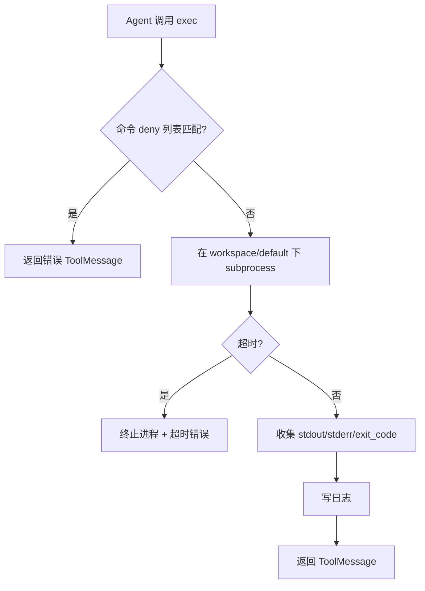

**建议配置（`config/tools_policy.yaml` 或 `.env`）：**

```yaml
exec:
  cwd: workspace/default/
  timeout_sec: 30
  deny_patterns:
    - "rm\\s+-rf"
    - "format\\s"
    - "\\.\\.[/\\\\]"          # 路径逃逸
  deny_commands:                # 联网走 web 工具，禁止 exec 滥用
    - curl
    - wget
    - Invoke-WebRequest
  max_output_bytes: 65536
```

#### 8.4.2 网络访问工具设计

**满足：** REQ-024, REQ-024-01 ~ 07, REQ-NFR-008

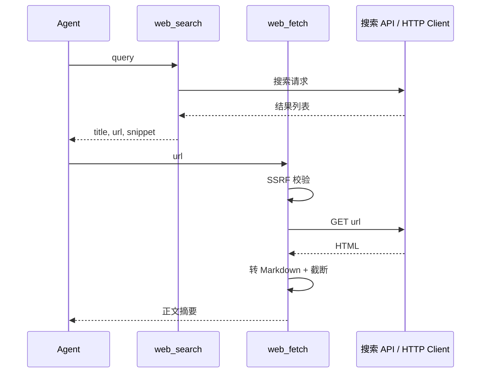

**`web_search` 实现选项（择一）：**

| 方案 | 说明 | 配置 |
|------|------|------|
| A | Tavily / Serper 等搜索 API | `WEB_SEARCH_API_KEY` |
| B | DuckDuckGo 等免费 API | 无 Key |
| C | LLM Provider 内置 web search | 随 LLM 配置 |

**`web_fetch` 实现要点：**

- 使用 `httpx` / `requests`，仅 `http`/`https`
- SSRF：拒绝 `127.0.0.1`、`10.*`、`192.168.*`、`169.254.*`、`localhost`
- 可选 `readability` / `html2text` 提取正文
- 默认超时 15s，最大 512KB

```yaml
web_fetch:
  timeout_sec: 15
  max_bytes: 524288
  allowed_schemes: [http, https]
  block_private_ips: true
  allowlist: []          # 空=不限制域名；非空=仅允许列表内

web_search:
  timeout_sec: 15
  max_results: 5
  provider: tavily       # tavily | serper | duckduckgo
```

#### Tool Policy 完整配置

```yaml
tools:
  allow:
    - read_file
    - list_dir
    - memory_search
    - memory_get
    - memory_append
    - search_knowledge
    - exec
    - web_search
    - web_fetch
  deny:
    - write_file
    - edit_file
    - apply_patch
    - add_document
    - delete_document
    - update_document
    - clear_knowledge_base

read_file:
  allowed_roots: [workspace/default/]
  max_bytes: 32768

list_dir:
  allowed_roots: [workspace/default/]

memory_append:
  allowed_files:
    - workspace/default/MEMORY.md
    - workspace/default/memory/

exec:
  cwd: workspace/default/
  timeout_sec: 30
  deny_patterns: ["rm\\s+-rf", "format\\s"]

web_fetch:
  timeout_sec: 15
  max_bytes: 524288
  block_private_ips: true

web_search:
  timeout_sec: 15
  max_results: 5
```

#### OpenClaw → Codex → NewHuman 矩阵

| OpenClaw | Codex | MVP | P1 | P2 |
|----------|-------|-----|----|----|
| read | read_file | read_file | | |
| — | list_dir | list_dir | | |
| write / edit | — | | write/edit | |
| apply_patch | apply_patch | | apply_patch | |
| exec | shell | **exec** | | |
| memory_* | — | memory_* | | |
| — | — | search_knowledge | | |
| web_search | web_search | **web_search** | | |
| web_fetch | — | **web_fetch** | | |

### 8.5 Skills

| Skill | 路径 | 需求 |
|-------|------|------|
| kb-qa | `skills/kb-qa/SKILL.md` | REQ-009 |

### 8.6 联调与观测

**满足：** REQ-ENV-006, REQ-NFR-005

Postman、show_graph.py、run.py、LangSmith（可选）。

### 8.7 知识库文档格式

PDF / TXT / MD / Excel（openpyxl, xlrd）。

### 8.8 实现检查清单

- [ ] ReAct 图编译通过
- [ ] 9 项 MVP 工具注册（含 web_search、web_fetch）
- [ ] exec deny curl/wget；web_fetch SSRF 校验
- [ ] TC-08 ~ TC-10 通过
- [ ] workspace 模板就绪
- [ ] TC-01 ~ TC-07 通过

---

## 9. API 设计

**满足：** REQ-001, REQ-002, REQ-022

### 8.1 POST /chat-messages

```json
{
  "query": "你好",
  "response_mode": "streaming",
  "conversation_id": "",
  "user": "user-123",
  "inputs": {}
}
```

SSE 事件：`message` | `message_end` | `error` | `workflow_finished`

### 8.2 建议新增

- `POST /workspace/setup`
- `GET /workspace/bootstrap`

---

## 10. 非功能设计

| 需求 | 设计措施 |
|------|----------|
| REQ-NFR-001 | 流式首 chunk；单 worker 演示 |
| REQ-NFR-002 | uvicorn + .env |
| REQ-NFR-003, REQ-NFR-007, REQ-NFR-008 | tool policy + exec/web 沙箱 |
| REQ-NFR-005 | Loguru；LangSmith 可选 |
| REQ-NFR-006 | WorkspaceManager 读 md 注入 |

---

## 11. 里程碑（技术交付）

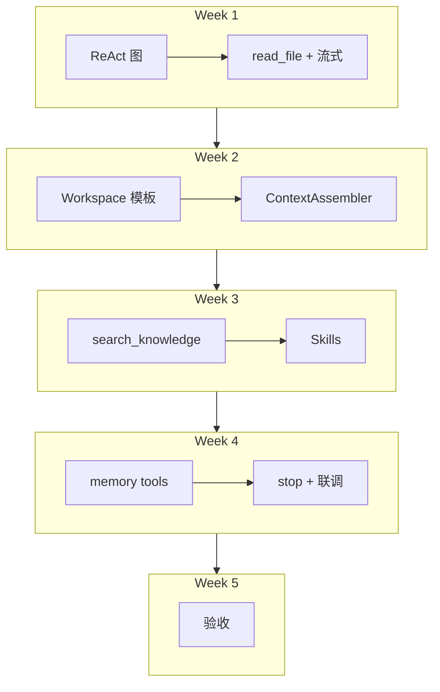

---

## 12. 附录

### 12.1 参考文档

- [OpenClaw Docs](https://docs.openclaw.ai/)
- [OpenClaw Agent Runtime](https://docs.openclaw.ai/concepts/agent)
- [OpenClaw Tools](https://docs.openclaw.ai/tools)
- [Codex Manual](https://developers.openai.com/codex/codex-manual)

### 12.2 修订记录

| 版本 | 日期 | 说明 |
|------|------|------|
| v1.0 | 2026-06-16 | 从 MVP需求设计文档 拆分 |
| v1.1 | 2026-06-16 | 新增 exec 设计（REQ-023） |
| v1.2 | 2026-06-16 | 新增 web_search / web_fetch 网络工具设计（REQ-024） |
| v1.3 | 2026-06-16 | 新增 §6 代码与文档结构设计 |

---

*设计变更须更新追溯矩阵，并确认 [需求文档](../0_需求文档/MVP需求文档_v1.0.md) 中对应 REQ 仍有效。*
