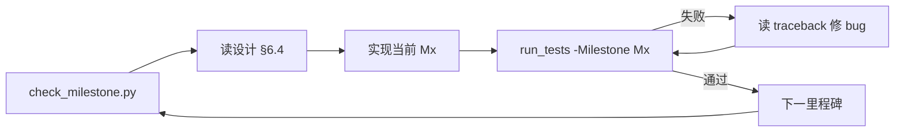

# Agent 自循环开发

本文指导 **Cursor Agent**（或同类 AI 编码助手）按里程碑 **自开发 → 自测 → 自修 → 确认** 完成 NewHuman MVP。

根目录 [AGENTS.md](../../AGENTS.md) 为 Cursor 自动加载的精简版；本文档为完整说明。

---

## 1. 流程概览



**原则：**

- 一次只做一个里程碑，不提前实现 Out-of-Scope 功能
- 测试失败时不跳过、不注释断言
- 最小 diff，遵循现有代码风格

---

## 2. 单次会话推荐 Prompt

```
当前里程碑: M1
请按 docs/1_设计文档/MVP设计文档_v1.0.md §6.4 实现 ReAct 图与 read_file。
完成后:
1. 启动 .\scripts\start_server.ps1（若未运行）
2. .\scripts\run_tests.ps1 -Milestone M1
3. 失败则修复直到通过
不要修改需求/设计文档除非接口契约变化。
```

将 `M1` 替换为 `check_milestone.py` 输出的当前目标。

---

## 3. 各里程碑实现要点

### M1 — Agent 核心

| 项 | 落点 |
|----|------|
| ReAct 图 | `func/graph/build.py` |
| LLM 节点 | `nodes/llm_call.py` — bind_tools + 流式 custom writer |
| 工具节点 | `nodes/tool_node.py` |
| 条件边 | `edges/should_continue.py` |
| read_file | `tools/file_tool.py` |
| 工具注册 | `tools/tool_registry.py` |

**通过标准：** TC-01（SSE）、TC-02（read SOUL.md）

### M2 — Workspace

| 项 | 落点 |
|----|------|
| 路径管理 | `workspace/manager.py` |
| System 注入 | `workspace/context_assembler.py` |
| llm_call 集成 | 首轮注入 SOUL/USER/AGENTS |

**通过标准：** TC-05

### M3 — Tools 与 KB

| 项 | 落点 |
|----|------|
| search_knowledge | 已有 `vectorstore_tool.py` |
| exec | 重构 `terminal_tool.py` |
| web | `tools/web_tool.py` |
| 策略 | `config/tools_policy.yaml` |

**通过标准：** TC-03, TC-08~10（移除对应 skip）

### M4 — Memory + Stop

| 项 | 落点 |
|----|------|
| memory 工具 | `tools/memory_tool.py` |
| stop | `agent_handler` + `chat_messages_service` 联调 |

**通过标准：** TC-06, TC-07

### M5 — 验收

- 启用所有 skip 测试
- `run_tests.ps1` 全绿
- 更新设计 §8.8 检查清单

---

## 4. Agent 必须遵守的约束

1. **工具策略：** MVP 仅 allow 列表内工具；禁止 write_file / edit_file / apply_patch
2. **exec：** cwd 限定 workspace；禁止 curl/wget
3. **web_fetch：** SSRF 防护（M3）
4. **配置：** 密钥只进 `.env`，不进 git
5. **文档：** 脚本/测试变更同步 `docs/2_开发文档/`

---

## 5. 命令速查

```powershell
python scripts\check_milestone.py
.\scripts\setup_workspace.ps1
.\scripts\start_server.ps1
.\scripts\run_tests.ps1 -SmokeOnly
.\scripts\run_tests.ps1 -Milestone M1
cd code\app; python -m func.graph.run
```

---

## 6. 已知限制

- 集成测试依赖**真实 LLM**，无 mock；无 API Key 时 integration 用例 skip
- Agent 无法在无人工确认下自动 push / 合并 PR
- 长任务可能因上下文截断中断，可 `resume` 并附上 `check_milestone.py` 输出

---

*与 [2_本地开发与脚本.md](./2_本地开发与脚本.md)、[3_验收测试与里程碑.md](./3_验收测试与里程碑.md) 配套使用。*
