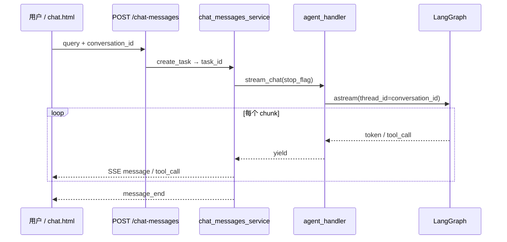
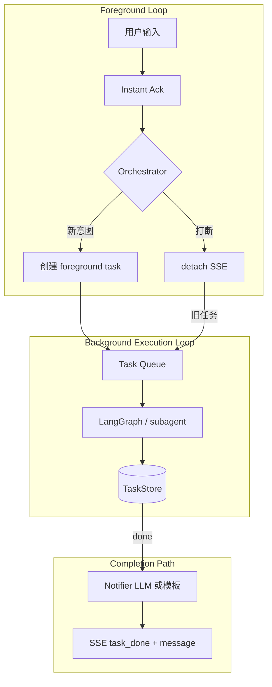
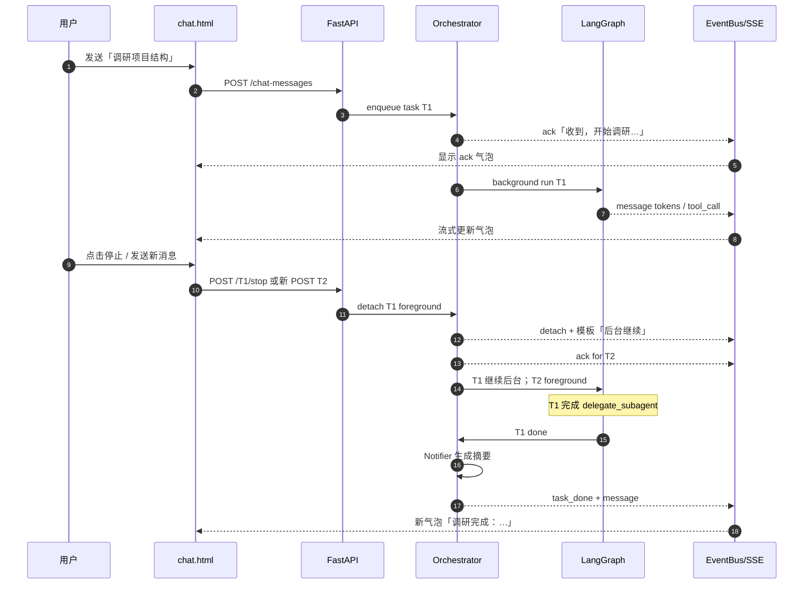

# NewHuman — 可打断对话与后台任务调研

| 属性 | 内容 |
|------|------|
| 文档版本 | v1.0 |
| 创建日期 | 2026-06-18 |
| 文档类型 | 技术调研 |
| 项目代号 | NewHuman |
| 关联需求 | REQ-002（stop）、MVP Out-of-Scope：多会话并发 / 后台 Agent |
| 关联文档 | [自主思考与能力自增调研](./自主思考与能力自增调研.md) |
| 状态 | 草案 |

---

## 1. 背景与目标

### 1.1 用户需求

用户希望在对话过程中获得更接近「真人助理」的交互体验：

| 能力 | 描述 |
|------|------|
| **对话中打断** | Agent 正在流式输出或执行工具时，用户可随时插话，不必等当前回合结束 |
| **后台持续思考** | 打断仅停止**当前对用户可见的 utterance**，底层任务（工具链、子 Agent、图执行）**不应被一并取消** |
| **连续任务摄入** | 用户可在上一任务尚未完成时发送新指令；系统应排队、并行或抢占，而非 `busy` 锁死输入框 |
| **必有回复** | 每次用户输入都应尽快得到 LLM（或等价）回应——至少是确认与状态，而非沉默 |
| **完成时主动通知** | 后台任务结束后，应触发新一轮对用户可见的回复（摘要、结果、下一步建议） |

这与 MVP 当前的「单 SSE 流、单 busy 锁、打断≈断连」形成明确差距，但与 [自主思考调研](./自主思考与能力自增调研.md) 中的 reflection / heartbeat **共享同一套任务平面**，可一并演进。

### 1.2 问题陈述

| 维度 | 现状 | 目标 |
|------|------|------|
| 打断语义 | 前端 `activeStreamId` 取消 fetch；服务端 `stop_event` 仅 break SSE 循环 | 打断 = _detach 前台流_，任务进入后台继续 |
| 用户输入响应 | `busy=true` 时拒绝发送 | 始终可发送；<200ms 内必有 ack |
| 任务生命周期 | 隐式绑定在一次 HTTP/SSE 请求上 | 显式 `task_id`：pending → running → done/failed |
| 完成通知 | 无；用户须停留在同一条流上等到 `message_end` | `task_done` 事件或新 message 推送到当前会话 |
| 与自主思考 | 无交集 | 同一 TaskStore；reflection 为 `source=heartbeat` 类任务 |

### 1.3 设计约束（继承 MVP）

- **最小 diff 演进**：优先在 `agent_handler` / `chat_messages_service` / `chat.html` 增量改造，不先拆微服务。
- **LangGraph 可复用**：已有 `MemorySaver` + `thread_id`；长远可用 `interrupt()` / `Command(resume=...)` 做 HITL，但「用户插话」≠ LangGraph interrupt（见 §2）。
- **Windows 本地**：首版用 `asyncio.create_task` + 进程内 TaskStore，不上 Celery。
- **安全**：后台任务仍受 workspace 沙箱与 `tools_policy.yaml` 约束。

---

## 2. 概念模型

### 2.1 双平面架构

```
┌─────────────────────────────────────────────────────────────────┐
│  Foreground Channel（对话 UX 平面）                                │
│  - SSE/WebSocket 推 token、tool_call、ack、task_done              │
│  - 用户感知：消息气泡、状态条、任务面板                            │
│  - 可随时 attach/detach；打断只影响本平面                          │
└───────────────────────────┬─────────────────────────────────────┘
                            │ subscribe / notify
┌───────────────────────────▼─────────────────────────────────────┐
│  Background Task Plane（任务执行平面）                             │
│  - LangGraph run、delegate_subagent、reflection_loop             │
│  - TaskStore：pending / running / done / cancelled               │
│  - 与 HTTP 连接生命周期解耦                                        │
└─────────────────────────────────────────────────────────────────┘
```

**关键区分：**

| 概念 | 含义 | 不应等同于 |
|------|------|------------|
| **Interrupt（用户打断）** | 停止向用户**继续流式输出**当前 assistant turn；可选截断未说完的 token | 取消 LangGraph run、kill 子进程 |
| **Cancel（任务取消）** | 显式终止后台 run（用户点「取消任务」或超时） | 用户只是发了新消息 |
| **LangGraph interrupt()** | 图在节点内暂停，等待 `Command(resume=...)` 注入人工输入 | Chat UI 的「停止生成」 |

### 2.2 会话、线程与任务 ID

| ID | 用途 | 当前实现 |
|----|------|----------|
| `conversation_id` | 用户可见会话；LangGraph `thread_id`；消息历史 | `chat.html` 从 SSE 回填 |
| `task_id` | 单次「用户意图 → Agent 执行」的工作单元 | `chat_service.create_task` 已生成，**前端未使用** |
| `stream_id` / `activeStreamId` | 前台 SSE 代际；新消息可 bump 使旧流失效 | 仅 `chat.html` 客户端 |

**推荐演进：** `conversation_id` 长期不变；每次用户发送产生新 `task_id`；同一 conversation 可有多条 `running` 任务（受 `max_parallel_tasks` 限制）。

### 2.3 「每次输入必有回复」的语义分层

用户说的「LLM 总有回复」应拆成三层，避免与「完整 ReAct 一轮」混为一谈：

| 层级 | 延迟目标 | 内容 | 实现 |
|------|----------|------|------|
| **L0 传输确认** | <50ms | HTTP 202 / SSE `ack` | 无需 LLM |
| **L1 即时应答（Instant Ack）** | <300ms | 「收到，正在分析仓库结构…」 | 模板 或 极小模型 / 规则 |
| **L2 前台回合** | 秒级 | 当前问题的完整 ReAct 流式回答 | 现有 `stream_chat` |
| **L3 后台完成通知** | 分钟级 | 「调研完成：…」 | Notifier LLM 或模板 + `task_done` |

**原则：** L0+L1 **必须**在每次用户输入后触发；L2 可被用户打断 detach；L3 在后台任务 terminal 时触发，且**不应**假设用户仍盯着同一条 SSE。

---

## 3. 现状分析

### 3.1 数据流（当前）



### 3.2 代码落点与行为

| 模块 | 路径 | 当前行为 | 与目标差距 |
|------|------|----------|------------|
| 前端 busy 锁 | `code/app/static/chat.html` L272–273, L466 | `busy=true` 时 `sendMessage` 直接 return | **无法**连续发消息 |
| 前端打断 | `chat.html` L454–461, L510–512 | `startNewChat` bump `activeStreamId`；读流时 cancel reader | 仅「新对话」路径；**无停止按钮**；未调 `POST /{task_id}/stop` |
| SSE 服务 | `code/app/service/chat_messages_service.py` | 已有 `stop_event`、`stop_task` | stop 只 break **消费循环**，不 cancel graph |
| Agent 桥接 | `code/app/func/graph/agent_handler.py` L97–98 | `stop_flag.is_set()` → `break` | 文档写 `workflow_finished` 但**未实现**；`astream` 生成器可能仍在服务端跑完 |
| Stop API | `code/app/api/v1/chat_messages.py` L81–106 | `POST /chat-messages/{task_id}/stop` | **前端未对接** |
| 图执行 | `code/app/func/graph/build.py` | 单 ReAct 图 + MemorySaver | 无任务队列节点；无 detach |
| 子 Agent | `code/app/func/graph/tools/subagent_tool.py` | `await graph.ainvoke` **同步阻塞** tool_node | 主图 tool 步内无法响应新用户消息 |

### 3.3 今天「打断」实际会发生什么

1. 用户点「新对话」→ `activeStreamId++` → 旧 SSE reader `cancel()` → UI 不再更新。
2. **服务端** `generate_streaming_response` 可能仍在 `async for agent_event in stream_chat`；若客户端断开，FastAPI 生成器或仍跑到图结束（取决于 Starlette 对断开连接的处理）。
3. `stop_flag` 被 set 时：`stream_chat` break → 不再 yield → `message_end` 可能**不发** → 用户看到半条气泡。
4. LangGraph **checkpoint 已写入**部分 messages；下次同 `conversation_id`  invoke 会带上未完成 tool 回合的脏状态——**无统一任务边界**。
5. `chat_service.active_tasks` 在 finally 标 `completed`，**不区分** stopped / success。

### 3.4 与自主思考文档的交叉

| 自主思考 Phase | 与本调研关系 |
|----------------|--------------|
| Phase 0 reflection CLI | 已是「无 SSE 的后台 run」原型 |
| Phase 2 `after_stream` hook | 应写入 TaskStore，而非仅写 memory |
| Phase 3 并行 subagent | 须先解决「主会话前台/后台分离」，否则并行 worker 无法向用户汇报 |

---

## 4. 核心设计问题（重点）

### 4.1 每次用户输入必有回复

#### 4.1.1 Instant Ack Pattern

**流程：**

```
用户发送 query
    → 立即 SSE: event=ack, task_id, text="好的，我开始处理：…"
    → （可选）立即 SSE: event=message 首包（模板或 nano-LLM）
    → 后台 asyncio.create_task(run_graph_task(...))
    → 前台流可 attach 到该 task 的 token 流，或用户打断后仅后台跑
```

**模板 vs 模型：**

| 策略 | 适用 | 优点 | 缺点 |
|------|------|------|------|
| **纯模板** | MVP Phase 0 | 零 token、确定延迟 | 生硬；难覆盖多样意图 |
| **规则 + 槽位** | 「正在 {verb} {object}」 | 低成本、可本地化 | 需从 query 抽动词/对象 |
| **Nano LLM**（小模型单轮） | Phase 1+ | 自然、可带情绪 | +1 次调用；须与主任务去重 |
| **主 LLM 首 token** | 不推荐作唯一 ack | 语义一致 | 首 token 仍可能 >2s；工具前无输出 |

**推荐组合（NewHuman）：**

- **Phase 0：** L0 `ack` + L1 模板（`收到。正在处理你的请求（任务 #{short_id}）…`）。
- **Phase 1：** 对长任务意图（含「调研」「全面」「所有」等）用 nano-LLM 生成一句 ack；短问答可直接进入 L2 流式。
- **禁止：** 用完整 ReAct 图跑 ack——成本高且与主任务竞态。

#### 4.1.2 打断后的回复义务

用户打断时仍应有 **L1 级**回复，例如：

> 「已暂停当前说明。我会在后台继续完成调研，完成后通知你。你可以继续输入新指令。」

该句可在打断 API 返回时由**服务端模板**产生，无需再等主 LLM。

#### 4.1.3 无回复失败模式（须避免）

| 失败模式 | 原因 |
|----------|------|
| `busy` 丢弃输入 | 前端锁 |
| 后台跑完无 SSE | 连接已断；无 task_done 通道 |
| 仅 `tool_call` 无 assistant 文本 | ReAct 多轮工具后用户已打断 |
| 同 conversation 并发 invoke 写乱 checkpoint | 两任务共用一个 `thread_id` 交错更新 |

### 4.2 任务完成触发回复

后台任务完成时，须把结果**重新接到 Foreground Channel**。可选机制：

#### 4.2.1 方案 A：同会话 SSE 长连接（事件多路复用）

- 浏览器维持 `GET /v1/conversations/{id}/events` WebSocket 或 SSE。
- 聊天 `POST /chat-messages` 只负责提交任务；token 与 `task_done` 都走长连接。
- **优点：** 真 push；可多个 `task_done`。
- **缺点：** 需改 `chat.html` 架构；连接管理复杂。

#### 4.2.2 方案 B：完成时注入新 Graph 回合（Notifier Invoke）

```python
# 伪代码
async def on_task_done(task: Task):
    summary = task.result_text  # 或 tool 输出聚合
    prompt = f"【系统】后台任务 {task.id} 已完成。结果摘要：\n{summary}\n请用简短中文告知用户。"
    async for chunk in agent_handler.stream_chat(prompt, task.conversation_id):
        await event_bus.publish(task.conversation_id, chunk)
```

- **优点：** 复用现有 LLM + 人格；自然语言通知。
- **缺点：** 额外 token；须防与用户正在进行的 L2 流冲突（串行化 notifier）。

#### 4.2.3 方案 C：结构化 `task_done` + 模板/轻量 LLM

```json
{
  "event": "task_done",
  "task_id": "...",
  "conversation_id": "...",
  "status": "succeeded",
  "title": "仓库结构调研",
  "summary": "...",
  "notify_style": "brief"
}
```

- 前端收到后插入 bot 气泡；若 `notify_style=llm`，服务端再异步跑 Notifier。
- **优点：** 可渐进；模板阶段零成本。
- **缺点：** 两阶段体验可能割裂。

#### 4.2.4 方案 D：轮询 `GET /tasks/{id}`

- MVP 最简但 UX 差；仅作无长连接时的降级。

**推荐路径：** Phase 1 用 **C（SSE 复用单次 POST 连接不可行，须独立 event 通道或 WebSocket）**；Phase 0 可退化：**轮询 + 用户仍开着页面时** `task_done` 经**新一次** `blocking` notifier 调用写入（实验用）。

**与 LangGraph 的关系：** 完成通知**不必** `Command(resume=...)` 恢复被用户打断的那次 run；更干净的做法是 **新 task**（`source=completion_notifier`）读取 TaskStore 结果生成对用户消息。

### 4.3 任务队列与优先级

用户在新消息到达时，主 Agent 可能仍在 `delegate_subagent` 或长跑 `exec` 中。

| 策略 | 行为 | 适用 |
|------|------|------|
| **Queue（FIFO）** | 新消息入队，当前任务跑完再处理 | 简单、状态清晰 |
| **Preempt（抢占）** | 当前任务 downgrade 为 background，立即为新消息开 foreground | 交互优先 |
| **Parallel workers** | 多任务同会话并行；checkpoint 用 per-task `thread_id` | 调研类可并行 |
| **Reject** | 返回「请等待」 | 仅 MVP 过渡 |

**推荐：Preempt + per-task thread_id**

- 每个 `task_id` 映射 `thread_id = f"{conversation_id}:{task_id}"` 或独立 UUID，避免 checkpoint 交错。
- 会话级「收件箱」合并：Notifier 读 TaskStore 时按 `conversation_id` 聚合。
- 主 Orchestrator（Phase 2）维护 `foreground_task_id`；新用户消息 → 旧任务 `visibility=background`（不 cancel）。

### 4.4 LangGraph interrupt 在本场景的定位

| 场景 | 是否用 `interrupt()` |
|------|---------------------|
| 用户点「停止生成」 | ❌ 用 detach SSE + 可选 cancel token |
| 工具调用需人工批准 | ✅ `interrupt({tool, args})` + `Command(resume=approve)` |
| 用户插话改需求 | ⚠️ 更适合**新 task** 而非 resume 旧图 |
| 后台任务完成 | ❌ 新 notifier invoke，非 resume |

NewHuman MVP 图（`build.py`）暂无 `interrupt()`；用户打断不应先改图，应先改 **Orchestration 层**。

---

## 5. 方案对比表

| 维度 | **A. 单图 + 内存队列** | **B. 双循环 Orchestrator** | **C. Job Worker + Chat Notifier** |
|------|------------------------|------------------------------|-----------------------------------|
| **概要** | FastAPI 内 `asyncio.Queue`；单进程消费；图仍一个 | 前台「对话循环」+ 后台「执行循环」两协程 | 独立 worker 进程跑图；API 只投递 job |
| **打断** | stop 仅标记；worker 继续 | 前台循环立即 ack；执行循环独立 | 同 B；worker 不受 HTTP 断开影响 |
| **完成通知** | TaskStore callback → SSE hub | `event_bus` → 长连接 | Redis pub/sub 或 DB poll → SSE |
| **并发** | 受 GIL/单进程 LLM 限制 | 可 `gather` 多后台任务 | 可水平扩展 worker |
| **checkpoint** | 每 task 独立 thread_id | 同左 | 需 Postgres checkpointer（远期） |
| **实现成本** | 低 | 中 | 高 |
| **与 reflection 统一** | 可共用 TaskStore | ⭐ 最佳 | ⭐ 最佳 |
| **Windows 本地** | ⭐⭐⭐⭐⭐ | ⭐⭐⭐⭐ | ⭐⭐ |
| **推荐阶段** | Phase 0–1 | Phase 1–2 | Phase 3+ |

---

## 6. 推荐架构（分阶段）

### Phase 0 — UI 打断 + 即时 Ack + 服务端任务继续（本周可试）

**目标：** 验证「打断 ≠ 杀任务」的产品感，最小代码面。

```
用户 Send
  → POST /chat-messages → task_id
  → 立即 SSE: ack + 模板 message
  → asyncio.create_task(_run_agent_background(task_id))  # 不绑定 SSE 生命周期
  → SSE 仅 attach 前台 token（可选）

用户 Stop / 新消息
  → POST /stop 或 bump stream generation
  → SSE detach；模板回复「后台继续…」
  → background task 仍跑（同进程）

任务完成
  → TaskStore status=done
  → 若会话有活跃 SSE 连接：push task_done
  → 否则：写 conversation_pending_notifications 文件（降级）
```

**限制：** 单进程；服务重启丢 running；无真正并行。

### Phase 1 — TaskStore + `task_done` 事件 + 会话事件通道

**目标：** 可靠完成通知；前端任务面板。

- 新增 `TaskStore`（内存 dict → SQLite）：`pending | running | done | failed | cancelled`。
- `chat.html`：停止按钮、任务列表、`EventSource` 或 WebSocket 订阅 `conversation_id`。
- SSE 事件类型扩展：`ack`、`task_started`、`task_progress`、`task_done`、`message`（现有）。
- `delegate_subagent` 标记 `parent_task_id`，进度可聚合。

### Phase 2 — 双循环 Orchestrator + Notifier LLM

**目标：** 连续摄入、抢占、自然语言完成通知。



- Orchestrator 模块：`code/app/func/graph/orchestrator.py`（新建）。
- 与 [自主思考 Phase 2](./自主思考与能力自增调研.md#phase-2--事件驱动) 共用 `after_task` hook。

### Phase 3 — 专用 Worker + 持久化 Checkpoint

- 子进程 / 任务计划程序跑长跑任务；PostgreSQL `checkpointer`；Celery 可选。
- 对齐 Cursor Cloud Agents「长任务与对话分离」产品形态（本地版）。

---

## 7. 技术落点（NewHuman）

### 7.1 建议新增

| 路径 | 职责 |
|------|------|
| `code/app/func/graph/task_store.py` | Task 元数据 CRUD、状态机、完成回调注册 |
| `code/app/func/graph/orchestrator.py` | 前台/后台分离、抢占、队列 |
| `code/app/func/graph/notifier.py` | `task_done` → 用户可见文案（模板 / LLM） |
| `code/app/api/v1/conversation_events.py` | SSE/WebSocket 多路事件（Phase 1） |
| `code/app/schema/task_model.py` | Task、Ack、TaskDone Pydantic 模型 |

### 7.2 建议修改

| 路径 | Phase 0 变更 |
|------|----------------|
| `code/app/func/graph/agent_handler.py` | `stream_chat` 支持 `detach_event`；`run_task_background()` 返回 TaskHandle；实现文档中的 `workflow_finished` 或改为 `task_done` |
| `code/app/service/chat_messages_service.py` | 首包 yield `ack`；`create_task` 与 graph run 解耦；stop 区分 `detach` vs `cancel` |
| `code/app/static/chat.html` | 去掉发送 `busy` 锁或改为「仅禁重复 submit」；**停止**按钮；保存 `task_id`；调 `POST /{task_id}/stop`；处理 `ack` / `task_done` |
| `code/app/api/v1/chat_messages.py` | 响应头或首 SSE 事件带 `task_id`（前端目前未解析） |
| `code/app/func/graph/tools/subagent_tool.py` | 接受 `task_id` 上下文；超时/完成写 TaskStore |
| `code/app/config/agent_config.py` | `max_parallel_tasks_per_conversation`、`ack_mode`、`notifier_mode` |

### 7.3 SSE 事件契约（建议扩展）

| event | 方向 | 载荷要点 |
|-------|------|----------|
| `ack` | S→C | `task_id`, `conversation_id`, `text` |
| `message` | S→C | 现有 `answer` 流式 |
| `tool_call` | S→C | 现有 |
| `task_started` | S→C | `task_id`, `title`, `estimated` |
| `task_progress` | S→C | `task_id`, `phase`, `percent?` |
| `task_done` | S→C | `task_id`, `status`, `summary`, `full_result_ref?` |
| `detach` | S→C | `task_id`, `reason=interrupted`, `background=true` |
| `message_end` | S→C | 仅 foreground stream 结束 |
| `error` | S→C | 现有 |

### 7.4 与 delegate_subagent / reflection 集成

| 模块 | 集成方式 |
|------|----------|
| `delegate_subagent` | 子 run 使用 `thread_id=subagent-{task_id}`；完成时更新父 task `subtasks[]` |
| `reflection_loop` | `source=heartbeat` 任务不进 chat，除非 `notify_user=true` |
| `memory_tool` | 任务完成 `memory_append` 可选；Notifier 可引用 |
| `context_assembler` | Notifier 短 prompt 仍注入 SOUL/USER 保持人格 |

---

## 8. UX 流程图



---

## 9. 风险

| 风险 | 表现 | 缓解 |
|------|------|------|
| **竞态：双 task 写同一 thread_id** | checkpoint 乱序、工具结果错位 | per-task `thread_id`；会话级 inbox 合并 |
| **重复回复** | ack + 完整回答 + task_done 三遍相似内容 | 明确 L1/L2/L3 分工；Notifier 只总结增量 |
| **Token 成本** | 每消息 ack+notifier 各一次 LLM | 默认模板；LLM notifier 仅长任务 |
| **用户困惑** | 不知后台是否还在跑 | 任务面板 + `task_progress`；detach 文案固定 |
| **孤儿任务** | 页面关闭后完成无人接收 | TaskStore 持久化；下次打开拉 `pending_notifications` |
| **stop 误杀** | `cancel` 与 `detach` 混用 | API 分 `POST .../stop?mode=detach|cancel` |
| **SSE 断开仍跑** | 资源占用 | `max_background_tasks`；空闲超时 cancel |
| **子 Agent 超时** | 父任务 hung | 已有 `subagent_timeout_sec`；写 task `failed` |

---

## 10. MVP 建议（本周最小实验）

### 10.1 实验目标

证明：**用户打断前台流后，同一 `task_id` 仍在服务端跑完，并能用第二次请求或模拟 `task_done` 把结果送回 UI。**

### 10.2 步骤（最小增量）

1. **`chat.html`**：记录首个 SSE 事件中的 `task_id`；增加「停止」按钮调用 `POST /v1/chat-messages/{task_id}/stop`；**移除** `if (!query || busy) return` 中的 busy 阻塞（改为 debounce）。
2. **`chat_messages_service.py`**：在 `generate_streaming_response` 开头 yield 模板 `ack` 事件。
3. **`agent_handler.py`**：抽出 `async def run_to_completion(task_id, ...)` 用 `asyncio.create_task` 在 stop detach 后继续消费 `astream` 直至结束，结果写入 `chat_service.active_tasks[task_id]["result"]`。
4. **模拟完成通知**：任务完成时若无法推 SSE，提供 `GET /v1/chat-messages/tasks/{task_id}` 返回 status+summary；前端轮询 2s×30。
5. **手工验收**：发长任务（「列出并 read 多个文件」）→ 中途 Stop → 再发「你好」→ 轮询见 T1 `completed` → 显示摘要。

### 10.3 通过标准

- [ ] 每次发送 ≤1s 内看到 ack 或首 token
- [ ] Stop 后 3s 内可再发送消息
- [ ] 停止的任务最终 `status=completed` 且 `result` 非空
- [ ] 同 `conversation_id` 历史可在后续消息中引用（手动验证即可）

### 10.4 刻意不做（留 Phase 1）

- WebSocket 长连接
- Notifier LLM
- Orchestrator 抢占
- SQLite TaskStore

---

## 11. 参考资料

### 11.1 外部产品与技术

| 主题 | 参考 |
|------|------|
| ChatGPT Stop generating | 停止的是**流式 token**，非删除已提交消息；长任务（Deep Research）与对话流分离 |
| Cursor Agent 中断 + 新消息 | 用户可发新消息打断；Cloud/Background Agents 长任务与 IDE 对话分离 — [Cursor Background Agents](https://cursor.com/help/ai-features/background-agents) |
| LangGraph interrupt / Command | [Interrupts 文档](https://docs.langchain.com/oss/python/langgraph/interrupts)；`interrupt()` + `Command(resume=...)` — HITL，非聊天 stop |
| LangGraph 持久化 | checkpoint + `thread_id` 恢复 — 与 per-task thread 策略相关 |
| OpenAI Responses background | `background: true` → `queued` → poll/webhook `response.completed` — [Background 模式说明](https://learn.microsoft.com/en-us/azure/foundry/openai/how-to/responses) |
| OpenAI Webhooks | `response.completed` / `failed` / `cancelled` — 完成通知产品层参考 |
| Anthropic streaming cancel | 客户端关闭连接 → 停止计费/生成（提供商侧）；应用层仍需 TaskStore |
| Celery / asyncio.Queue | 进程内优先 `asyncio.Queue`；多机再 Celery |
| Human-in-the-loop vs fire-and-forget | HITL：图内 `interrupt` 等人；fire-and-forget：提交即返回，完成回调 — NewHuman 用户打断属后者 |

### 11.2 NewHuman 内部

| 文档 / 代码 | 说明 |
|-------------|------|
| [自主思考与能力自增调研](./自主思考与能力自增调研.md) | 共享 TaskStore、reflection 后台 run |
| [MVP设计文档 v1.0](../1_设计文档/MVP设计文档_v1.0.md) | REQ-002 stop、§ API |
| `code/app/service/chat_messages_service.py` | `active_tasks`、`stop_event` |
| `code/app/static/chat.html` | `busy`、`activeStreamId` |
| `code/app/func/graph/agent_handler.py` | `stream_chat`、`stop_flag` |
| `code/app/func/graph/tools/subagent_tool.py` | 同步子图、`subagent_timeout_sec` |

---

## 附录 A — Orchestrator 状态机（草案）

```
                    ┌─────────────┐
         create     │   pending   │
        ──────────► │             │
                    └──────┬──────┘
                           │ start
                           ▼
                    ┌─────────────┐     detach      ┌─────────────┐
                    │  running    │ ───────────────►│ background  │
                    │ (foreground)│                 │  running    │
                    └──────┬──────┘                 └──────┬──────┘
                           │                               │
              cancel       │         complete              │ complete
                           ▼                               ▼
                    ┌─────────────┐                 ┌─────────────┐
                    │  cancelled  │                 │    done     │
                    └─────────────┘                 └──────┬──────┘
                                                           │
                                                           ▼
                                                    notify → user
```

---

## 附录 B — Instant Ack 模板示例

```text
收到。正在处理：{intent_short}（任务 {task_short_id}）
预计需要一点时间；你可以继续输入其他问题，完成后我会通知你。
```

`intent_short` 规则示例：query 前 30 字截断；或关键词映射（调研→「正在调研」、读文件→「正在读取文件」）。

---

*文档结束。实现 Phase 0 时建议同步更新 [2_本地开发与脚本.md](../2_开发文档/2_本地开发与脚本.md) 增加 stop/ack 联调说明。*
