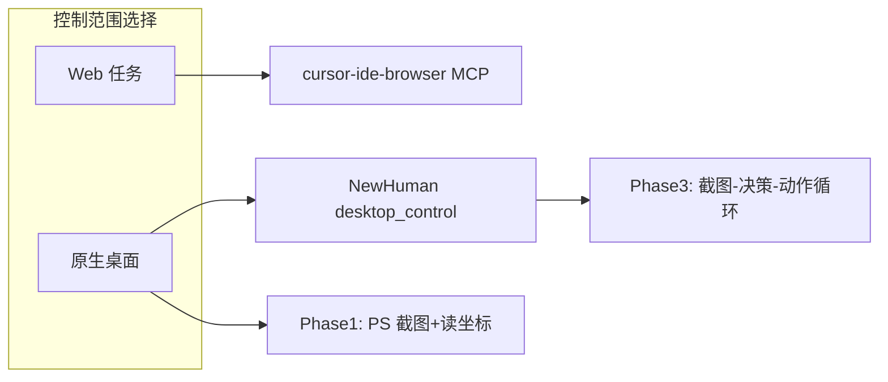

# NewHuman 桌面控制与键鼠模拟调研

| 属性 | 内容 |
|------|------|
| 文档版本 | v1.0 |
| 创建日期 | 2026-06-18 |
| 文档类型 | 技术调研 |
| 项目 | NewHuman（`E:/personal_project/NewHuman`） |
| 目标平台 | Windows 10（win32） |
| 状态 | 草案 |

---

## 1. 背景与目标

### 1.1 用户需求

用户希望 NewHuman Agent 能够**控制本机桌面**，而不仅限于 workspace 内的文件与终端命令。具体能力包括：

| 能力 | 说明 |
|------|------|
| 截图 | 获取当前屏幕（或指定区域）像素，供 LLM 视觉理解 |
| 读鼠标位置 | 返回光标屏幕坐标 |
| 移动 / 点击鼠标 | 左键、右键、拖拽、滚轮 |
| 键盘模拟 | 输入文本、快捷键、组合键 |
| 闭环操作 | 截图 → 模型决策 → 执行动作 → 再截图（Computer Use 模式） |

用户明确要求：**尽量通过终端（PowerShell）实现**，Python 作为 Phase 2 封装层。

### 1.2 与 MVP 现状的关系

NewHuman MVP 的工具面以 **workspace 沙箱** 为核心：

- `exec_powershell`：在 `workspace/default/` 下执行 PowerShell，30s 超时，输出截断 64KB（`powershell_tool.py`）
- `read_file` / `list_dir`：路径限定 workspace
- `fetch_url`：HTTP 出站 + SSRF 防护
- **无** 截图、键鼠、窗口控制工具

桌面控制是 **全局副作用**：点击可能触发任意应用、截图可能包含密码与聊天内容。这与 MVP「最小权限、可审计」原则冲突，必须 **默认关闭 + 显式 opt-in**。

### 1.3 调研范围

- **截图**：PowerShell/.NET、Python（mss / pyautogui / PIL）、Win32 API
- **鼠标 / 键盘**：pyautogui、pynput、pywinauto、PowerShell P/Invoke、SendInput
- **高层模式**：Anthropic Computer Use、Open Interpreter、OSWorld、UI Automation
- **替代范围**：浏览器内控制（Cursor `cursor-ide-browser` MCP）
- **安全**：误操作、隐私、勒索软件式滥用、用户确认
- **内部**：`tool_registry.py`、`exec_powershell`、设计文档 §8.4 exec 策略

---

## 2. 能力矩阵

### 2.1 总览对比表

| 方案 | 截图 | 读光标 | 移动/点击 | 键盘 | 终端优先 | 依赖 | 稳定性 | 适合 NewHuman |
|------|:----:|:------:|:---------:|:----:|:--------:|------|--------|---------------|
| **A. PowerShell + .NET** | ✅ 好 | ✅ | ⚠️ 可 P/Invoke | ⚠️ SendKeys 弱 | ⭐⭐⭐⭐⭐ | 无 pip | 中（DPI/多屏需注意） | **MVP 首选** |
| **B. Python pyautogui** | ⚠️ 慢 | ✅ | ✅ | ✅ | ❌ | pip | 中（仅主屏可靠） | Phase 2 封装 |
| **B2. Python pynput** | ❌ | ✅ 监听强 | ✅ | ✅ | ❌ | pip | 中高 | 热键/监听场景 |
| **B3. Python mss** | ✅ 快 | ❌ | ❌ | ❌ | ❌ | pip | 高 | 与 B 组合 |
| **C. pywinauto / UIA** | ⚠️ 间接 | ❌ | ✅ 控件级 | ✅ | ❌ | pip | **高（标准控件）** | Phase 2 定向自动化 |
| **D. AutoHotkey** | ✅ | ✅ | ✅ | ✅ | ⚠️ 外部进程 | 安装 AHK | 高 | 可选外挂脚本 |
| **Win32 SendInput** | — | GetCursorPos | ✅ 底层 | ✅ 底层 | ⚠️ ctypes/P/Invoke | — | 高 | 被 B/A 封装 |
| **Anthropic Computer Use** | ✅ 协议层 | ✅ | ✅ | ✅ | ❌ | API + 本地执行器 | 实验性 | Phase 3 视觉闭环 |
| **cursor-ide-browser MCP** | ✅ 页内 | ❌ | ✅ 页内 | ✅ 页内 | — | Cursor 内置 | 高（Web） | **Web 任务替代** |

### 2.2 按能力细分

#### 截图

| 实现 | 典型 FPS (1080p) | 多显示器 | 含鼠标指针 | 备注 |
|------|-------------------|----------|--------------|------|
| PS `CopyFromScreen` | ~10–30 | VirtualScreen 可全屏 | 需额外 Draw 光标 | 零依赖，MVP 友好 |
| Python **mss** | ~30–60 | ✅ monitors[] | ❌ | 纯 ctypes，跨平台 |
| Python **pyautogui** | ~1–5 | ⚠️ 主屏为主 | ❌ | 自带 0.1s 延迟（可关 FAILSAFE） |
| PIL `ImageGrab` | ~10–15 | Windows OK | ❌ | 简单但慢 |
| **DXcam / BetterCam** | 100–240+ | Windows | ❌ | 游戏/vision 专用，过重 |
| Win32 `BitBlt` | 中 | 需自处理 | ❌ | 与 .NET 等价底层 |

#### 鼠标

| 实现 | 坐标系 | 后台点击 | DPI 缩放 | 备注 |
|------|--------|----------|----------|------|
| PS `SetCursorPos` + `mouse_event` | 屏幕绝对 | ❌ 前台 | ⚠️ 需 DPI aware | P/Invoke user32 |
| pyautogui | 屏幕绝对 | ❌ | ⚠️ | API 最简单 |
| pynput | 屏幕绝对 | ❌ | 较好 | 监听+控制一体 |
| pywinauto `click()` | 控件消息 | ✅ 部分控件 | 较好 | 不移动物理光标 |
| pywinauto `click_input()` | 屏幕绝对 | ❌ | 较好 | 真实鼠标，易被用户干扰 |

#### 键盘

| 实现 | Unicode / 中文 | 组合键 | 游戏/低级钩子 | 备注 |
|------|------------------|--------|---------------|------|
| PS `[System.Windows.Forms.SendKeys]` | ❌ 弱 | ⚠️ 有限 | ❌ | 仅适合 ASCII 表单 |
| pyautogui.write/typewrite | ⚠️ | ✅ hotkey | ❌ | 英文为主 |
| pynput | ✅ | ✅ | ⚠️ | 需处理布局 |
| `keyboard` 库 | ✅ | ✅ | ⚠️ 需管理员 | 全局热键方便 |
| Win32 **SendInput** | ✅ | ✅ | 较好 | 推荐底层 API |

---

## 3. Windows 方案详解

### 3.1 方案 A：PowerShell + .NET（终端优先）

**定位**：MVP 阶段 **零 pip 依赖**，直接复用现有 `exec_powershell`；截图与读光标足够支撑「观察桌面」。

#### 3.1.1 全屏截图（VirtualScreen）

```powershell
Add-Type -AssemblyName System.Windows.Forms, System.Drawing
$screen = [System.Windows.Forms.SystemInformation]::VirtualScreen
$bmp = New-Object System.Drawing.Bitmap $screen.Width, $screen.Height
$g = [System.Drawing.Graphics]::FromImage($bmp)
$g.CopyFromScreen($screen.Left, $screen.Top, 0, 0, $bmp.Size)
# 可选：绘制鼠标指针
$cur = [System.Windows.Forms.Cursor]::Position
$rect = New-Object System.Drawing.Rectangle($cur, [System.Windows.Forms.Cursor]::Current.Size)
[System.Windows.Forms.Cursors]::Default.Draw($g, $rect)
$out = Join-Path (Get-Location) "screenshots/desktop_$(Get-Date -Format 'yyyyMMdd_HHmmss').png"
New-Item -ItemType Directory -Force -Path (Split-Path $out) | Out-Null
$bmp.Save($out, [System.Drawing.Imaging.ImageFormat]::Png)
$g.Dispose(); $bmp.Dispose()
Write-Output "saved:$out"
```

**注意**：

- 须在 **交互式用户会话** 中运行（与 NewHuman FastAPI 同用户）；服务跑在 Session 0 则截图为空。
- 高 DPI / 125% 缩放下，`VirtualScreen` 与物理像素可能不一致；后续专用工具应 `SetProcessDpiAwareness(2)`。
- 输出路径应落在 **workspace** 内，便于 `read_file` 或后续 vision API 读取（PNG 二进制需 Base64 或专用 `screenshot` 工具返回）。

#### 3.1.2 读取鼠标位置（user32 GetCursorPos）

```powershell
Add-Type @"
using System;
using System.Runtime.InteropServices;
public class Win32Cursor {
    [StructLayout(LayoutKind.Sequential)] public struct POINT { public int X; public int Y; }
    [DllImport("user32.dll")] public static extern bool GetCursorPos(out POINT lpPoint);
}
"@
$p = New-Object Win32Cursor+POINT
[void][Win32Cursor]::GetCursorPos([ref]$p)
Write-Output "x=$($p.X) y=$($p.Y)"
```

#### 3.1.3 移动与点击（可行但不推荐长期留在 PS）

```powershell
Add-Type @"
using System;
using System.Runtime.InteropServices;
public class Win32Input {
    [DllImport("user32.dll")] public static extern bool SetCursorPos(int X, int Y);
    [DllImport("user32.dll")] public static extern void mouse_event(uint dwFlags, uint dx, uint dy, uint dwData, int dwExtraInfo);
    public const uint MOUSEEVENTF_LEFTDOWN = 0x0002;
    public const uint MOUSEEVENTF_LEFTUP   = 0x0004;
}
"@
[Win32Input]::SetCursorPos(500, 300)
[Win32Input]::mouse_event([Win32Input]::MOUSEEVENTF_LEFTDOWN, 0, 0, 0, 0)
[Win32Input]::mouse_event([Win32Input]::MOUSEEVENTF_LEFTUP, 0, 0, 0, 0)
```

**键盘**：`SendKeys` 对 `{ENTER}`、`^c` 等有限支持，**不适合中文输入**；Phase 2 应改用 Python `pyautogui` 或 Win32 `SendInput`。

| 优点 | 缺点 |
|------|------|
| 无新依赖，与 `exec_powershell` 一致 | 脚本冗长，Agent 易生成错误 P/Invoke |
| 运维熟悉，易手工验证 | 点击/输入安全审计困难 |
| 截图质量足够 LLM 理解 | 无结构化返回值（需解析 stdout） |

---

### 3.2 方案 B：Python pyautogui / pynput / mss（推荐工具封装）

**定位**：Phase 2 新增 `desktop_tool.py`，由 **专用 LangChain Tool** 调用，而非让 Agent 随意 `pip install` + 拼脚本。

#### 3.2.1 推荐组合

| 库 | 用途 |
|----|------|
| **mss** | 高速截图（vision 循环） |
| **pyautogui** | 移动、点击、键入、hotkey |
| **pynput** | 可选：监听用户中断 / 全局热键 Esc 紧急停止 |

```python
# 示意：desktop_tool 内部（非 MVP 实现）
import mss
import pyautogui

pyautogui.FAILSAFE = True   # 鼠标甩到左上角中止
pyautogui.PAUSE = 0.05      # 略低于默认 0.1s

def screenshot_region(path: str, region: tuple | None = None) -> str:
    with mss.mss() as sct:
        mon = sct.monitors[0 if region is None else 1]
        img = sct.grab(region or mon)
        mss.tools.to_png(img.rgb, img.size, output=path)
    return path

def click(x: int, y: int, button: str = "left") -> None:
    pyautogui.click(x, y, button=button)

def type_text(text: str) -> None:
    pyautogui.write(text, interval=0.02)  # 中文需 pyperclip + ctrl-v 或 SendInput
```

#### 3.2.2 pyautogui 关键限制

- **仅主显示器**可靠（PyPI 文档明确说明）；多屏需 mss 指定 monitor index + 坐标映射。
- 每次调用默认 **0.1s 延迟**；vision 循环中显式降低 `PAUSE`。
- `locateOnScreen` 依赖 Pillow，慢，适合偶发 UI 定位而非高频 loop。

#### 3.2.3 pynput vs pyautogui

| | pyautogui | pynput |
|---|-----------|--------|
| 控制 | ✅ 简单 | ✅ |
| 监听 | ❌ | ✅ 键盘/鼠标 hook |
| 场景 | Agent 执行动作 | 用户按 Esc 取消自主模式 |

| 优点 | 缺点 |
|------|------|
| API 统一，社区示例多 | 新增 pip 依赖与部署复杂度 |
| 与 Anthropic Computer Use 参考实现一致 | 进程需与桌面同 session |
| mss+pyautogui 性能可支撑 vision loop | 中文输入需额外处理 |

---

### 3.3 方案 C：UI Automation（控件级，更稳）

**定位**：当目标为 **标准 Win32/UWP 控件**（设置、资源管理器、对话框）时，优先 UIA 而非 blind 坐标点击。

- **pywinauto**（`backend="uia"`）：连接进程 → `print_control_identifiers()` → `window.child_window(title="确定").click()`。
- **Microsoft UIA**：Accessibility Insights、FlaUI（.NET）可辅助探测控件树。
- **Windows SDK**：`IUIAutomation` COM 接口，PowerShell 7 调用较繁琐。

| 优点 | 缺点 |
|------|------|
| 对 DPI、窗口移动不敏感（控件级） | 无法操作 Canvas/WebView/游戏 |
| 可后台 `click()` 发消息 | Flash、Electron 自定义 UI 识别差 |
| 误点概率低于坐标 | 学习曲线高，Agent 难自动写可靠脚本 |

**建议**：Phase 2 可选 `uia_click(title, automation_id)` 工具；与坐标点击 **二选一** 由 planner 决定。

---

### 3.4 方案 D：AutoHotkey 外部脚本

**定位**：用户机器已装 AutoHotkey 时，可通过 `exec_powershell` 调用 `AutoHotkey.exe script.ahk` 执行复杂宏。

```powershell
& "C:\Program Files\AutoHotkey\AutoHotkey.exe" "workspace\default\scripts\click_save.ahk"
```

| 优点 | 缺点 |
|------|------|
| 语法专为桌面自动化设计 | 额外安装，非仓库可控 |
| 社区脚本丰富 | 安全审计更难 |
| 热键、窗口管理强 | 与 Agent 动态生成逻辑结合弱 |

**建议**：作为 **用户可选扩展**，不纳入 NewHuman 核心依赖。

---

### 3.5 高层桌面 Agent 模式（Phase 3 参考）

#### Anthropic Computer Use

- 模型侧：`computer_20250124` 工具，动作集 `screenshot | mouse_move | left_click | type | key | ...`。
- **执行侧由开发者实现**（截图 + pyautogui/nut-js）；非 Claude 直接操控 OS。
- OSWorld 基准：单 Agent 截图模式约 **15–22%** 任务成功率——坐标误差、延迟、动态 UI 仍是难题。
- 与 NewHuman 关系：可复用 **同一 action schema**，本地 LLM 替换 Claude API。

#### Open Interpreter

- 「Computer Use」模式：解释器 + 视觉模型 + 本地执行；偏 **自然语言 → Python 代码 → 执行**。
- 风险更高（任意代码）；NewHuman 应对齐 **显式工具** 而非任意 `exec`。

#### 浏览器-only（cursor-ide-browser MCP）

- 已具备：`browser_navigate`、`browser_click`、`browser_snapshot` 等。
- **适用**：Web 应用、文档、SaaS；**不适用**：原生桌面、文件对话框、系统设置。
- 建议：需求若仅为「操作网页」，优先 MCP，**不启桌面控制**。



---

## 4. 与 NewHuman 集成建议

### 4.1 现状摘要

| 模块 | 路径 | 与桌面控制关系 |
|------|------|----------------|
| PowerShell 执行 | `code/app/func/graph/tools/powershell_tool.py` | cwd=workspace，可跑截图 PS，但 **无结构化 API** |
| 工具注册 | `code/app/func/graph/tools/tool_registry.py` | 硬编码 `_MVP_TOOLS`；设计文档建议 `tools_policy.yaml` 尚未落地 |
| 网络 SSRF | `code/app/func/graph/tools/web_tool.py` | 可类比：**桌面工具需 allowlist + 开关** |
| AGENTS.md | 仓库根 | exec 禁 curl；桌面控制 **不在 MVP In-Scope** |

### 4.2 建议新增工具

**方案一（推荐）：单一网关工具**

| 工具名 | 说明 |
|--------|------|
| `desktop_control` | 统一入口，`action` 枚举：`screenshot` / `get_cursor_pos` / `mouse_move` / `mouse_click` / `keyboard_type` / `keyboard_hotkey` |

**方案二：细粒度工具**

| 工具名 | 说明 |
|--------|------|
| `screenshot` | 保存到 workspace 或返回 base64（大小限制） |
| `get_cursor_pos` | 返回 `{x, y}` |
| `mouse_move` | 参数 x, y |
| `mouse_click` | x, y, button, clicks |
| `keyboard_type` | text, interval |
| `keyboard_hotkey` | keys[] |

**推荐方案一**：便于统一审计、限流、开关；与 Anthropic action 映射简单。

示例 schema（示意）：

```json
{
  "tool": "desktop_control",
  "args": {
    "action": "screenshot",
    "region": [0, 0, 1920, 1080],
    "save_path": "screenshots/last.png"
  }
}
```

### 4.3 沙箱：必须在 workspace 外

| 资源 | workspace 沙箱 | 桌面控制 |
|------|----------------|----------|
| 文件读写 | ✅ 限定根目录 | 截图 **写入** workspace，**读取** 全局屏幕 |
| exec cwd | ✅ workspace | 动作影响 **全局前台** |
| 网络 | fetch_url 策略 | 无直接关系 |

**设计结论**：

1. 桌面工具 **不得** 复用 `read_file` 路径校验逻辑作为「控制范围」。
2. 截图文件落盘路径 **必须** 限制在 `workspace/{user}/screenshots/`。
3. 控制动作本身 **无法沙箱**——只能通过 **开关、确认、速率限制** 降低风险。

### 4.4 配置建议

`.env` / `config/desktop_control.yaml`（建议）：

```yaml
desktop_control:
  enabled: false                    # DESKTOP_CONTROL_ENABLED=false 默认关闭
  require_user_confirm: true        # 首次启用或每会话一次
  allowed_actions:                  # MVP 仅观察
    - screenshot
    - get_cursor_pos
  # Phase 2 再开放：
  # - mouse_move
  # - mouse_click
  # - keyboard_type
  screenshot:
    max_width: 1920
    max_height: 1080
    max_bytes: 2097152              # 2MB
    save_dir: screenshots           # 相对 workspace
  input:
    max_text_length: 256
    rate_limit_per_minute: 30
    block_when_on_lock_screen: true # 需检测 WTS 会话
```

`tool_registry.get_allowed_tools()` 在 `enabled=false` 时不注册 `desktop_control`。

### 4.5 与 exec_powershell 的分工

| 场景 | 用法 |
|------|------|
| MVP 实验 / 用户手工 | 允许通过 `exec_powershell` 跑 **只读** 截图/读坐标脚本（文档化模板） |
| 生产 | **禁止** Agent 自由拼接 P/Invoke；必须走 `desktop_control`（内部调用审过的 PS 或 Python） |
| 策略 | `tools_policy.yaml` 的 `exec.deny_patterns` 增加 `SetCursorPos|mouse_event|SendKeys`（启用 desktop_control 后） |

### 4.6 用户确认模式

1. **会话级**：用户发送「启用桌面控制」→ API 设置 session flag → 后续方可调用。
2. **动作级（高危）**：`mouse_click` / `keyboard_type` 前 SSE 推送 `pending_action`，用户 `/approve` 或 UI 按钮确认（Phase 2）。
3. **物理急停**：pyautogui FAILSAFE（左上角）；可选 pynput 监听 **Esc** 中止当前 ReAct 图。

---

## 5. 分阶段落地

### Phase MVP（本周可试）

**目标**：观察桌面，**零写入除截图文件外**。

| 项 | 内容 |
|----|------|
| 能力 | `screenshot` + `get_cursor_pos` |
| 实现 | `desktop_control` 工具内部调用 **审过的 PowerShell 脚本**（§3.1） |
| 配置 | `DESKTOP_CONTROL_ENABLED=true` 手动开启 |
| 测试 | 手工 `exec_powershell` 验证 → 再封装工具 |
| 不在范围 | 点击、键盘、vision 自动循环 |

### Phase 2：输入执行

| 项 | 内容 |
|----|------|
| 能力 | `mouse_move`、`mouse_click`、`keyboard_type`、`keyboard_hotkey` |
| 实现 | Python `pyautogui` + `mss`；中文用 clipboard paste |
| 安全 | 动作级确认、速率限制、审计日志（坐标+文本 hash） |
| 可选 | pywinauto 子命令 `uia_click` |

### Phase 3：Vision 闭环

| 项 | 内容 |
|----|------|
| 模式 | 截图 → 多模态 LLM → action → 循环直到 stop / max_steps |
| 参考 | Anthropic Computer Use action schema |
| 限制 | max_steps=20、单轮超时、仅允许 allowlist 窗口（可选 HWND） |
| 成本 | 截图 token 大；需缩放 JPEG、区域裁剪、`zoom` 等价物 |

---

## 6. 风险与合规

### 6.1 误操作

| 风险 | 缓解 |
|------|------|
| 点错按钮（删除、转账） | 默认只读；点击需确认；FAILSAFE |
| 坐标漂移（DPI / 多屏） | 文档化测试；Phase 2 引入 UIA |
| 与真实用户抢鼠标 | 自主模式独占；或仅无用户输入 N 秒后执行 |

### 6.2 隐私与凭证暴露

| 风险 | 缓解 |
|------|------|
| 截图含密码管理器、聊天 | 截图 **不自动进长期 memory**；日志脱敏 |
| 截图上传第三方 LLM | 用户 consent；本地模型选项 |
| 截图留盘 | workspace 内定期清理；max_bytes 限制 |

### 6.3 滥用与「防勒索」

| 风险 | 缓解 |
|------|------|
| Agent 被 prompt 注入诱导狂点 | 工具 allowlist；Anomaly 检测（点击频率） |
| 恶意 Skill 调用 desktop | Skill 不能扩展工具面；desktop 独立开关 |
| 远程 API 被攻破 | 默认 disabled；仅 localhost 或鉴权 Gateway |

### 6.4 范围控制

| 策略 | 说明 |
|------|------|
| 单窗口 | Phase 3：截图前 `GetForegroundWindow` + 只裁剪该 HWND 区域 |
| 应用 allowlist | 仅允许 `notepad.exe`、`explorer.exe` 等（配置化） |
| 与 exec 隔离 | 禁止 desktop 工具内嵌 `exec_powershell` 任意命令 |

---

## 7. MVP 实验步骤

以下命令可在 **NewHuman 交互终端** 或 **`exec_powershell`** 中直接运行（PowerShell）。工作目录为 workspace 根。

### 7.1 实验 1：截图到 workspace

```powershell
Add-Type -AssemblyName System.Windows.Forms, System.Drawing
$dir = Join-Path (Get-Location) "screenshots"
New-Item -ItemType Directory -Force -Path $dir | Out-Null
$screen = [System.Windows.Forms.SystemInformation]::VirtualScreen
$bmp = New-Object System.Drawing.Bitmap $screen.Width, $screen.Height
$g = [System.Drawing.Graphics]::FromImage($bmp)
$g.CopyFromScreen($screen.Left, $screen.Top, 0, 0, $bmp.Size)
$path = Join-Path $dir "test_$(Get-Date -Format 'yyyyMMdd_HHmmss').png"
$bmp.Save($path, [System.Drawing.Imaging.ImageFormat]::Png)
$g.Dispose(); $bmp.Dispose()
Write-Output "OK path=$path size=$($screen.Width)x$($screen.Height)"
```

**验证**：在 workspace 下出现 PNG；用系统查看器打开确认内容正确。

### 7.2 实验 2：读取鼠标位置

```powershell
Add-Type @"
using System; using System.Runtime.InteropServices;
public class C {
  [StructLayout(LayoutKind.Sequential)] public struct P { public int X; public int Y; }
  [DllImport("user32.dll")] public static extern bool GetCursorPos(out P p);
}
"@
$p = New-Object C+P
[void][C]::GetCursorPos([ref]$p)
"{""x"":$($p.X),""y"":$($p.Y)}"
```

**验证**：移动鼠标后重复执行，坐标应变化。

### 7.3 实验 3（可选，**慎用**）：在记事本中输入

不在 MVP 推荐路径；若手工测试 Phase 2：

```powershell
# 需已打开 Notepad 且聚焦；仅演示 SendKeys 局限
Add-Type -AssemblyName System.Windows.Forms
[System.Windows.Forms.SendKeys]::SendWait("Hello from NewHuman{ENTER}")
```

### 7.4 实验成功标准

- [ ] 截图文件可在 workspace 内找到且可打开
- [ ] 光标坐标 JSON 解析正确
- [ ] FastAPI 与终端在同一 Windows 用户会话运行
- [ ] **未** 在未授权情况下执行点击/输入

---

## 8. 参考资料

### 8.1 截图

- [PDQ: Capturing screenshots with PowerShell and .NET](https://www.pdq.com/blog/capturing-screenshots-with-powershell-and-net/)
- [Windows OS Hub: Desktop screenshot PowerShell](https://woshub.com/take-user-desktop-screenshot-with-powershell/)
- [Microsoft Docs: Graphics.CopyFromScreen](https://learn.microsoft.com/en-us/dotnet/api/system.drawing.graphics.copyfromscreen)
- [Python mss (PyPI)](https://pypi.org/project/mss/)
- [PyAutoGUI documentation](https://pyautogui.readthedocs.io/)

### 8.2 键鼠与 Win32

- [PyAutoGUI — mouse/keyboard API](https://pyautogui.readthedocs.io/en/latest/)
- [pynput documentation](https://pynput.readthedocs.io/)
- [pywinauto documentation](https://pywinauto.readthedocs.io/)
- [SendInput (Microsoft Learn)](https://learn.microsoft.com/en-us/windows/win32/api/winuser/nf-winuser-sendinput)

### 8.3 Computer Use / Agent 基准

- [Anthropic: Computer use tool (API)](https://platform.claude.com/docs/en/agents-and-tools/tool-use/computer-use-tool)
- [Anthropic: Developing a computer use model](https://www.anthropic.com/research/developing-computer-use)
- [OSWorld benchmark](https://os-world.github.io/) — 桌面任务评估

### 8.4 NewHuman 内部

- [MVP 设计文档 §8.4 exec](../1_设计文档/MVP设计文档_v1.0.md) — cwd、deny、超时
- `code/app/func/graph/tools/powershell_tool.py` — exec 实现
- `code/app/func/graph/tools/tool_registry.py` — 工具注册
- [自主思考与能力自增调研](./自主思考与能力自增调研.md) — 同目录文档风格参考
- [AGENTS.md](../../AGENTS.md) — MVP 约束与测试流程

### 8.5 替代方案

- Cursor **cursor-ide-browser** MCP — Web 自动化，非本机全局桌面

---

## 附录 A：推荐 MVP 决策摘要

| 决策项 | 选择 |
|--------|------|
| MVP 能力 | 仅 **screenshot + get_cursor_pos** |
| MVP 实现 | **PowerShell + .NET**，封装为 `desktop_control` 工具 |
| 默认状态 | **关闭**（`DESKTOP_CONTROL_ENABLED=false`） |
| 沙箱 | 截图落 workspace；控制动作为全局，靠开关+确认 |
| Phase 2 | Python pyautogui + mss；动作级用户确认 |
| Web 任务 | 优先 browser MCP，不启桌面控制 |

---

## 附录 B：术语对照

| 术语 | 含义 |
|------|------|
| Computer Use | 视觉模型 + 截图/action 闭环的桌面 Agent 模式 |
| UIA | Windows UI Automation，控件级自动化 |
| VirtualScreen | 所有显示器合并后的虚拟桌面矩形 |
| FAILSAFE | pyautogui 将鼠标移至屏幕角落实时中止 |
| Session 0 隔离 | Windows 服务会话无法交互桌面 |

---

*本文档为 Post-MVP 能力预研；实现前请更新需求文档、扩展 `tools_policy`，并完成安全评审。*
