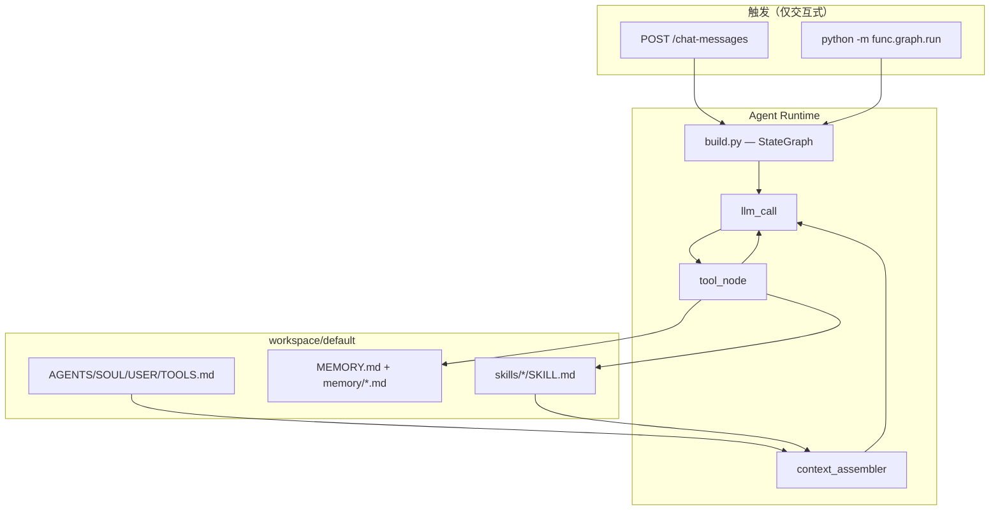
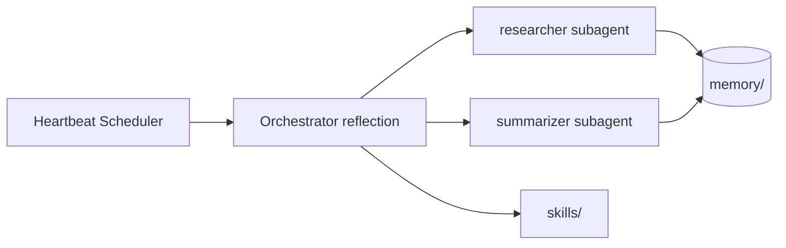

# NewHuman — 自主思考与能力自增调研

| 属性 | 内容 |
|------|------|
| 文档版本 | v1.0 |
| 创建日期 | 2026-06-18 |
| 文档类型 | 技术调研 |
| 项目代号 | NewHuman |
| 关联需求 | MVP Out-of-Scope：Cron / 后台 Agent（PRD §3.2） |
| 状态 | 草案 |

---

## 1. 背景与目标

### 1.1 用户需求

用户希望 NewHuman 不仅能「等人说话」，还能在**无人交互时持续思考**：

- **自主反思**：回顾近期对话、记忆、工作区变化，提炼结论并写入长期记忆；
- **能力自增**：发现重复工作流后自动创建或更新 Skill，扩展可复用能力；
- **后台运行**：像「心跳」一样周期性唤醒，或在事件（对话结束、新文件）后触发，而非完全依赖 HTTP 请求。

这与 MVP 当前的「请求驱动 ReAct」形成明确差距，属于 **P1+ 演进方向**，需在现有 Workspace + 工具面基础上增量建设，而非推倒重来。

### 1.2 问题陈述

| 维度 | 现状 | 目标 |
|------|------|------|
| 触发方式 | 用户发消息 → FastAPI / 终端 `run.py` | 手动 / 定时 / 事件三种触发并存 |
| 思考产物 | 对话内 ToolMessage，偶发 `memory_append` | 结构化日志 + MEMORY  consolidation + 可选新 Skill |
| 持续性 | 进程退出即停止；checkpoint 为内存 MemorySaver | 可调度、可审计、可限流的独立 reflection 运行 |
| 安全边界 | workspace 沙箱 + 工具注册表 | 自主模式下更严格的「只读默认 / 需审批写入」 |

### 1.3 设计约束（继承 MVP）

- **Workspace 驱动**：行为变更优先改 Markdown（`AGENTS.md`、`HEARTBEAT.md`、Skill），少改核心图结构。
- **对齐 OpenClaw 记忆模型**：`MEMORY.md` + `memory/YYYY-MM-DD.md`，经 `memory_*` 工具读写。
- **单人可维护**：首版避免引入 LangGraph Platform 托管、K8s CronJob 等重依赖；Windows 本地以 PowerShell + 任务计划程序为主。

---

## 2. 现状分析

### 2.1 已有架构（可复用）



**核心模块：**

| 模块 | 路径 | 自主思考相关能力 |
|------|------|------------------|
| ReAct 图 | `code/app/func/graph/build.py` | 完整 observe→act 循环，但**无独立 reflection 节点** |
| 上下文组装 | `code/app/func/graph/workspace/context_assembler.py` | Bootstrap + Skills 索引 + 工具规则；**无 HEARTBEAT / 反思 prompt** |
| 记忆工具 | `code/app/func/graph/tools/memory_tool.py` | OpenClaw 风格 daily/summary；**无自动 consolidation 任务** |
| 技能 | `workspace/default/skills/skill-creator/SKILL.md` | 人工或对话触发创建 Skill；**无离线提取** |
| 子 Agent | `code/app/func/graph/tools/subagent_tool.py` | 同步委派 researcher/coder 等；**非后台 worker** |
| 工具注册 | `code/app/func/graph/tools/tool_registry.py` | 含 write_file/edit_file（已注册）；策略见 `tools_policy.yaml` |
| 会话 | `MemorySaver` + `thread_id` | **进程内内存**；重启丢失；无「系统 reflection 线程」 |

### 2.2 与 OpenClaw 对标差距

| OpenClaw 能力 | NewHuman MVP | 差距 |
|---------------|--------------|------|
| `memory/YYYY-MM-DD.md` 日誌 | ✅ `memory_append(target=daily)` | 已对齐 |
| `MEMORY.md` 长期摘要 | ✅ `memory_update_summary` | 已对齐；**无自动从 daily 晋升** |
| Session 启动读 today+yesterday | ❌ MEMORY 不自动注入 | 反思轮次需主动 `memory_read` |
| HEARTBEAT.md 周期检查 | ❌ 无 | 需新增 bootstrap 文件 + 调度 |
| Memory flush（compaction 前） | ❌ 无 compaction | 仅有 `trim_to_last_turns`（默认 3 轮） |
| Cron / 夜间 consolidation | ❌ PRD 明确 Out-of-Scope | Phase 1+ 实现 |
| 语义 memory_search | ⚠️ 关键词匹配 | 无向量 hybrid search |

### 2.3 关键缺口清单

1. **无后台调度入口**：没有 cron、heartbeat、队列消费者。
2. **无 reflection 专用图或 prompt**：ReAct 图假设每条 HumanMessage 来自用户。
3. **无「静默回合」约定**：OpenClaw 用 `NO_REPLY` 避免骚扰用户；NewHuman 流式 API 总会推 SSE。
4. **无任务/反思状态持久化**：缺少 `reflection/` 或 `tasks.json` 记录上次运行、待办、token 预算。
5. **Skill 自增仅被动**：依赖用户说「创建 skill」或 Agent 当场判断；无从事后 trace 批量提取。
6. **子 Agent 同步阻塞**：`delegate_subagent` 适合对话内分解，不适合 7×24 后台 worker 池。

---

## 3. 业界方案对比

| 方案 | 代表 | 触发方式 | 记忆/状态 | 能力扩展 | 优点 | 缺点 | 与 NewHuman 契合度 |
|------|------|----------|-----------|----------|------|------|-------------------|
| **Heartbeat 清单** | OpenClaw `HEARTBEAT.md` | 每 N 分钟一次 Agent turn | daily log + MEMORY；today/yesterday 注入 | Skill 文件 + cron | 与现有 workspace 模型一致；实现简单 | 易刷日志、费 token；调度曾不稳定（研究报道） | ⭐⭐⭐⭐⭐ |
| **夜间 Consolidation** | OpenClaw Dreaming / memory-core cron | 每日 3:00 等固定时刻 | daily → MEMORY 三阶段 | 间接改善行为 | 控制成本；长期记忆质量高 | 非实时；需精心写 prompt（delta-only） | ⭐⭐⭐⭐ |
| **Compaction Memory Flush** | OpenClaw pre-compaction | 上下文将满时 | 静默写入 daily | — | 防失忆 | NewHuman 尚无 compaction | ⭐⭐⭐（Phase 2） |
| **LangGraph Cron** | LangSmith Deployment crons | 服务端 cron 表达式 | PostgreSQL checkpoint | 同 assistant | 生产级、可水平扩展 | 需托管 Platform；MVP 为 MemorySaver | ⭐⭐（远期） |
| **Ambient Agents** | LangChain ambient 概念 | 事件 + 持久化 + interrupt | 内置 persistence | 工具/MCP | 官方叙事完整 | 与自托管 FastAPI 路径不同 | ⭐⭐⭐ |
| **Task Queue 无限循环** | BabyAGI 2023 归档版 | `while True` 取任务 | 向量任务库 | 自生成子任务 | 经典 autonomous 范式 | 易失控、成本高；原版已归档 | ⭐⭐ |
| **Self-building Functions** | BabyAGI functionz | DB 触发器 | 函数图 + 日志 | 动态注册 Python 函数 | 能力自增强 | 与 Markdown Skill 哲学不一致 | ⭐ |
| **Think-Act 开放循环** | AutoGPT | 目标驱动多轮 | 向量记忆 | 插件 | 灵活 | 难收敛、安全难控 | ⭐⭐ |
| **Reflexion** | Shinn et al. NeurIPS 2023 | 任务失败后多 trial |  verbal 反思缓冲 | — | 无需微调；易落地为 prompt+文件 | 需评估器；多 trial 费 token | ⭐⭐⭐⭐ |
| **SkillEvo / AutoSkill** | ECNU AutoSkill 2026 | 离线 replay + 晋升 | SKILL.md 版本化 | 自动 merge Skill | 与 NewHuman Skill 格式一致 | 需 trace 采集与评测 | ⭐⭐⭐⭐ |
| **Cloud / Background Agents** | Cursor Cloud Agents | API / Automations 定时 | 云端 VM + git | MCP、PR | 长任务、可离线 | 外部 SaaS；非本地 NewHuman | ⭐（参考产品形态） |
| **OS 级 Cron + 脚本** | 自托管通用 | Windows 任务计划 / APScheduler | 文件 | 脚本生成 Skill | 零平台依赖；贴合单人项目 | 需自管进程、日志、锁 | ⭐⭐⭐⭐⭐ |

**结论：** NewHuman 最自然的路径是 **OpenClaw 式 Heartbeat + 文件记忆 + Reflexion/SkillEvo 式事后 consolidation**，用 **PowerShell/cron 脚本触发独立 reflection 运行**，而非先把 ReAct 图改成 7×24 无限循环。

---

## 4. 核心模式

### 4.1 Reflection Loop（observe → think → act → store）

```
┌─────────────┐    ┌──────────────┐    ┌─────────────┐    ┌──────────────┐
│ Observe     │───►│ Think        │───►│ Act         │───►│ Store        │
│ 读 memory/  │    │ LLM 规划     │    │ 工具调用    │    │ memory_append│
│ 会话摘要    │    │ 是否需 Skill │    │ 可选委派    │    │ 更新 HEARTBEAT│
│ list_dir    │    │              │    │             │    │ 写 reflection/│
└─────────────┘    └──────────────┘    └─────────────┘    └──────────────┘
```

**Observe（输入）**

- `memory_read`：今日/昨日 daily、`MEMORY.md` 摘要
- 可选：`reflection/last_run.json`（上次运行时间、结论）
- 可选：最近 N 条对话摘要（从 DB 或导出 JSON，Phase 2）

**Think（推理）**

- 专用 system prompt：`你是 NewHuman 反思模块，用户不可见，输出须简洁`
- 产出结构：{ observations, insights, actions[], skill_candidates[] }

**Act（行动，白名单）**

- 默认只读：`memory_read`、`memory_search`、`list_dir`、`read_file`
- 写入：`memory_append`（daily）、`memory_update_summary`（仅高价值）
- 能力扩展：`read_file skill-creator` → `mkdir` + `write_file` 新 Skill（需 Phase 1 策略开关）
- 复杂调研：`delegate_subagent(role=researcher)`（慎用，耗 token）

**Store（持久化）**

- 所有行动写入 `memory/YYYY-MM-DD.md` 的 `## Reflection HH:MM` 段
- 运行元数据：`reflection/YYYY-MM-DD_HHmmss.json`（耗时、token、action 列表）

### 4.2 Skill 自创建流水线

借鉴 AutoSkill / OpenClaw skill-creator，建议 **「提议 → 评审 → 写入 → 验证」** 四步：

| 阶段 | 执行者 | 输入 | 输出 |
|------|--------|------|------|
| 提议 | Reflection LLM | 近期 daily 中重复模式（≥3 次相似用户请求） | `skill_candidates[]` 草稿 |
| 评审 | 规则 + 可选 LLM | 名称规范、与现有 skills 去重 | 通过 / 驳回 |
| 写入 | `write_file` | `skills/<name>/SKILL.md` | 新 Skill 目录 |
| 验证 | `read_file` + 索引刷新 | 下轮 `context_assembler.list_skills()` | 新对话可见 |

**触发条件（建议全部满足才自动写入）：**

- 同一工作流在 7 天内出现 ≥3 次；
- 用户未明确反对（可在 USER.md 设「禁止自动建 skill」）；
- Phase 0 仅生成 `reflection/skill_drafts/<name>.md`，**人工确认**后再 `write_file`。

### 4.3 Memory Consolidation（daily → MEMORY.md）

OpenClaw / Sora Labs 实践要点：

1. **Delta-only**：只记录「自上次反思以来的变化」，无变化则一行 `no changes`。
2. **晋升规则**：仅 **决策、偏好、 durable 事实** 进 `MEMORY.md`；过程性日志留 daily。
3. **频率**：daily 反思可每 2–4 小时；MEMORY 合并建议 **每日一次**（如 03:00）。
4. **长度控制**：`MEMORY.md` 保持 <4KB；超出则归档到 `memory/archive/` 并在 MEMORY 留索引。

NewHuman 已有 `memory_update_summary(mode=append|replace)`，consolidation 回合可专用 prompt：

> 阅读 `memory/{today,yesterday}.md`，提取应长期保留的条目，用 `memory_update_summary` 追加；不要重复已有 MEMORY 内容。

### 4.4 安全边界（自主 Agent 不应做的事）

| 类别 | 禁止 / 限制 | 理由 |
|------|-------------|------|
| 对外通信 | 禁止自发邮件、消息、webhook | 无用户在场 |
| 破坏性 exec | 禁止 `rm -rf`、格式化、改系统目录 | workspace 外不可控 |
| 无限循环 | 单轮 reflection 最多 M 次 tool call（如 15） | 防 token 爆炸 |
| 并发反思 | 文件锁 `reflection/.lock` | 防双实例写乱 memory |
| Skill 泛滥 | 每轮最多创建 1 个 Skill；重名拒绝 | 防 workspace 污染 |
| 用户可见输出 | 反思默认 **blocking 无 SSE** 或写文件不推 chat | 避免半夜骚扰 |
| Git / 部署 | 禁止自主 commit、push、重启服务 | 需人工门禁 |
| 子 Agent 递归 | 反思模式 `max_subagent_depth=0` 或禁用 delegate | 简化审计 |

**推荐默认策略：** Phase 0–1 反思进程使用 **只读 + memory_append**；Skill 创建仅产出 draft；Phase 2 起通过 `AUTONOMOUS_MODE=limited|full` 环境变量放开 `write_file`。

---

## 5. 推荐架构（分阶段）

### Phase 0 — 手动触发（本周可试）

**目标：** 验证 reflection prompt 与 memory 写入链路，零调度依赖。

```
用户或开发者 ──► scripts/run_reflection.ps1 ──► reflection_loop.py ──► 同一 build_graph()
                                                      │
                                                      ▼
                                            memory/ + reflection/*.json
```

- 触发词：终端输入「开始自主思考」或环境变量 `REFLECTION_PROMPT=...`
- 使用独立 `thread_id=reflection-{uuid}`，与用户对话隔离
- 产物仅写 workspace，不调用 `/chat-messages`

### Phase 1 — 定时 Heartbeat（cron / 任务计划程序）

**目标：** 空闲时每 N 小时自动反思一次。

```
Windows 任务计划程序 (每 2h)
        │
        ▼
run_reflection.ps1 -Mode heartbeat
        │
        ├─ 检查 reflection/.lock + 上次运行时间（防抖）
        ├─ 读取 workspace/HEARTBEAT.md 清单
        └─ 执行 reflection_loop（max_steps=10, 只读+memory）
```

- 新增 `workspace/default/HEARTBEAT.md`：轻量 checklist（≤30 行）
- 配置项：`REFLECTION_INTERVAL_HOURS=2`、`REFLECTION_IDLE_ONLY=true`（可选：有活跃 SSE 则跳过）

### Phase 2 — 事件驱动

| 事件 | 触发 | 动作 |
|------|------|------|
| 对话结束 | FastAPI `after_stream` hook | 异步 queue → 轻量摘要写入 daily |
| 新 Skill 文件 | watchdog / git hook | 校验 SKILL.md 格式 |
| daily 体积 > 阈值 | 同上 consolidation cron | 晋升 MEMORY |
| 用户 `/reflect` 命令 | chat 指令 | 同步跑一轮并回复摘要 |

实现选项：

- **轻量：** PowerShell `Register-ObjectEvent` / Python `watchdog` 仅写 queue 文件
- **中等：** FastAPI BackgroundTasks + SQLite `reflection_queue` 表
- **重量：** Redis + Celery worker（单人项目不推荐首版）

### Phase 3 — 多 Agent 后台 Worker

**目标：** 反思主控 + 专职 worker 并行。



- Orchestrator 用 `delegate_subagent` **并行**（需改 asyncio.gather，当前为顺序）
- 独立进程池或 LangGraph Platform（若未来上 PostgreSQL checkpoint）
- 与 Cursor Cloud Agents 不同：仍本地、workspace 为中心

---

## 6. 技术落点（针对 NewHuman）

### 6.1 建议新增文件

| 路径 | 职责 |
|------|------|
| `scripts/run_reflection.ps1` | 入口：激活 conda、设 `PYTHONPATH`、调 reflection CLI |
| `code/app/func/graph/reflection_loop.py` | 反思主逻辑：组 prompt、调 graph、写 `reflection/` 元数据 |
| `code/app/func/graph/reflection_prompt.py` | Observe/Think/Act/Store 各阶段 prompt 模板 |
| `code/app/config/reflection_config.py` | 间隔、max_steps、模式（readonly/limited/full）、锁路径 |
| `workspace/default/HEARTBEAT.md` | 周期检查清单（OpenClaw 对标） |
| `workspace/default/skills/reflection/SKILL.md` | 教 Agent 在用户对话中手动触发反思流程 |
| `workspace/default/skills/skill-evolution/SKILL.md` | 从 daily 提取 Skill 草案的规范 |
| `reflection/.gitkeep` | 运行产物目录（json、drafts、lock） |
| `docs/3_调研文档/自主思考与能力自增调研.md` | 本文档 |

### 6.2 建议修改文件（Phase 0–1）

| 路径 | 变更 |
|------|------|
| `code/app/func/graph/run.py` | 增加 `--reflection` CLI 模式 |
| `code/app/func/graph/workspace/context_assembler.py` | 可选：reflection 模式注入 `HEARTBEAT.md` |
| `scripts/setup_workspace.ps1` | 模板增加 `HEARTBEAT.md`、`skills/reflection/` |
| `code/app/config/agent_config.py` | `reflection_max_tool_steps`、`reflection_allow_write` |
| `code/app/func/graph/tools/tool_registry.py` | `get_tools_for_mode("reflection")` 子集 |

### 6.3 与现有模块集成

**memory_tool**

- Reflection 结束必须调用 `memory_append(note=..., target="daily")` 记录摘要
- Consolidation 专用回合调用 `memory_update_summary`
- 搜索历史模式：`memory_search` 查重复工作流关键词

**skill-creator**

- 自动 Skill 前 **强制** `read_file skills/skill-creator/SKILL.md`
- Phase 0 只写 `reflection/skill_drafts/<name>.md`，格式与 SKILL.md 相同
- Phase 2 自动写入后提示用户下轮新对话生效（与现 skill-creator 行为一致）

**delegate_subagent**

- Reflection 默认禁用；仅 `REFLECTION_ALLOW_SUBAGENT=true` 时开放 researcher
- 子任务示例：「搜索 memory 中所有关于 X 的条目并列表」

**build_graph / ReAct**

- **不新增图节点**（最小 diff）：reflection 作为「带特殊 system prompt 的一次 ainvoke」
- 后续若步骤固定，可拆 LangGraph 子图：`reflection_observe → reflection_act → END`

### 6.4 调度器选型（Windows 本地）

| 工具 | 适用阶段 | 说明 |
|------|----------|------|
| **任务计划程序** | Phase 1 | 调用 `run_reflection.ps1`；无需常驻进程 |
| **APScheduler** | Phase 2（进程内） | 嵌入 FastAPI lifespan；服务停则停 |
| **Celery + Redis** | Phase 3 | 多 worker；运维成本高 |
| **Temporal** | 不推荐 MVP | 长事务强，单人过重 |

推荐：**Phase 1 用任务计划程序 + 文件锁**；若希望「随 FastAPI 一起跑」，Phase 2 再加 APScheduler。

### 6.5 reflection_loop 伪代码（实现参考）

```python
# code/app/func/graph/reflection_loop.py（示意，非最终实现）

async def run_reflection(mode: str = "manual") -> ReflectionResult:
    acquire_lock("reflection/.lock")
    try:
        prompt = build_reflection_prompt(
            heartbeat=read_optional("HEARTBEAT.md"),
            last_run=read_optional("reflection/last_run.json"),
        )
        thread_id = f"reflection-{uuid4()}"
        result = await graph.ainvoke(
            {"messages": [HumanMessage(content=prompt)], "query": prompt},
            config={"configurable": {"thread_id": thread_id}},
        )
        write_run_metadata(result)
        return result
    finally:
        release_lock()
```

---

## 7. 风险与约束

| 风险 | 表现 | 缓解 |
|------|------|------|
| **Token 成本** | 每 2h 一次 full ReAct，日 12+ 次 LLM 调用 | 专用小模型；heartbeat 只读；delta-only prompt；可配置 interval |
| **无限循环** | Agent 反复 `memory_append` 或 list_dir | `max_tool_steps`；同一工具连续 3 次相同参数则 abort |
| **Workspace 污染** | Skill/memory 爆炸 | draft 模式；MEMORY 大小上限；定期人工 review |
| **记忆错误累积** | 错误推断写入 MEMORY | consolidation 需「证据引用」；USER.md 可标记纠正 |
| **与用户对话冲突** | 反思写文件时用户也在 chat | 文件锁；reflection 不写用户正在编辑的路径 |
| **checkpoint 丢失** | MemorySaver 重启无历史 | reflection 不依赖 checkpoint 持久化，产物落盘即可 |
| **安全** | `exec_powershell` 在自主模式被滥用 | reflection 模式从 tool_registry 排除 exec |
| **幻觉式 Skill** | 创建从未发生过的「伪工作流」 | 须引用 daily 行号作为 evidence |

---

## 8. MVP 建议（本周可做最小实验）

### 8.1 实验目标

用 **一次手动 reflection** 验证：LLM 能否在无用户新问题的情况下，读取 memory、产出摘要并写入 daily。

### 8.2 步骤（无需改代码的临时方案）

1. 启动 Agent：`.\scripts\run_agent.ps1`
2. 粘贴以下用户消息（模拟 Phase 0 prompt）：

```
【系统反思模式 — 用户不可见回复】
请执行一轮自主反思：
1. memory_read 列出可用记忆；读取今日 daily 与 MEMORY.md
2. list_dir skills 查看现有技能
3. 总结：今日有何可沉淀事实？是否有重复工作流可做成 Skill 草案？
4. memory_append 将摘要写入今日 daily，target=daily
5. 最终仅输出 5 行以内中文摘要
```

3. 检查 `workspace/default/memory/YYYY-MM-DD.md` 是否新增 `## Reflection` 段。

### 8.3 通过标准

- [ ] daily 中出现结构化反思条目
- [ ] 未调用危险 exec
- [ ] 单轮 tool 调用 ≤15 次
- [ ] 摘要对用户可见部分 ≤5 行（若走 chat API）

### 8.4 下一步最小代码增量（Phase 0）

1. 添加 `reflection_loop.py` + `run_reflection.ps1`（固定 prompt，独立 thread）
2. `setup_workspace.ps1` 增加 `HEARTBEAT.md` 模板
3. 文档化 Windows 任务计划程序示例（每 2h 调用 ps1）

---

## 9. 参考资料

### 9.1 OpenClaw / 记忆与 Heartbeat

- [OpenClaw Memory 概念文档](https://github.com/openclaw/openclaw/blob/main/docs/concepts/memory.md) — daily log、MEMORY.md、memory flush
- [OpenClaw Memory Management — Sora Labs](https://sora-labs.net/guides/memory-management/) — heartbeat 频率、delta-only、dreaming consolidation
- [OpenClaw Memory Masterclass — VelvetShark](https://velvetshark.com/openclaw-memory-masterclass) — 会话重置与记忆策略
- [OpenClaw: Agent of Chaos — Medium](https://chuckrussell.medium.com/openclaw-agent-of-chaos-5e800c8ed58a) — 自主机制实证与 cron 稳定性讨论

### 9.2 Agent 模式与自改进

- [Reflexion 模式文档](https://agent-patterns.readthedocs.io/en/stable/patterns/reflexion.html) — 多 trial verbal reinforcement
- [Reflexion 论文 NeurIPS 2023](https://proceedings.neurips.cc/paper_files/paper/2023/file/1b44b878bb782e6954cd888628510e90-Paper-Conference.pdf)
- [Better Ways to Build Self-Improving AI Agents — Yohei Nakajima](https://yoheinakajima.com/better-ways-to-build-self-improving-ai-agents/)
- [BabyAGI 仓库（functionz / 自构建）](https://github.com/yoheinakajima/babyagi) — 2023 task-loop 已归档至 babyagi_archive
- [AutoSkill / SkillEvo](https://github.com/ECNU-ICALK/AutoSkill) — SKILL.md 经验驱动演进

### 9.3 调度与平台

- [LangChain — Introducing ambient agents](https://www.langchain.com/blog/introducing-ambient-agents) — persistence + cron 叙事
- [LangSmith — Use cron jobs](https://docs.langchain.com/langsmith/cron-jobs) — LangGraph Platform 定时任务
- [LangGraph JS Crons SDK](https://github.com/langchain-ai/langgraphjs/blob/main/libs/sdk/docs/crons.md)

### 9.4 Cursor / 背景 Agent 产品形态

- [Cursor — What are background agents?](https://cursor.com/help/ai-features/background-agents) — Cloud Agents 定义
- [Cursor — Cloud Agents / Automations](https://cursor.com/help/ai-features/cloud-agents) — 定时与事件触发
- [Cursor Cloud Agents API](https://cursor.com/docs/cloud-agent/api/endpoints) — 程序化启动长任务

### 9.5 NewHuman 内部文档

- [MVP需求文档 v1.0](../0_需求文档/MVP需求文档_v1.0.md) — §3.2 Out-of-Scope：Cron / Multi-agent
- [MVP设计文档 v1.0](../1_设计文档/MVP设计文档_v1.0.md) — §3.6 Memory、§3.4 Skills
- [Agent自循环开发](../2_开发文档/4_Agent自循环开发.md) — 里程碑驱动（与「自主思考」正交互补）
- 代码：`memory_tool.py`、`context_assembler.py`、`subagent_tool.py`、`skill-creator/SKILL.md`

---

## 附录 A — HEARTBEAT.md 模板草案

```markdown
# HEARTBEAT — 周期自检清单

> 反思模式读取本文件；无事项则 memory_append 一行 `no changes`。

## 每次检查

1. 读取今日 memory daily：是否有未沉淀的用户偏好/决定？
2. memory_search 近期重复主题（如「周报」「部署」）→ 是否需 Skill 草案？
3. list_dir skills：是否有过时技能需标注？

## 仅记录 delta

- 只写**自上次反思以来**的新变化
- 无变化 → `no changes`

## 禁止

- 不执行 exec
- 不创建 Skill 文件（Phase 0–1 仅写 reflection/skill_drafts/）
```

---

## 附录 B — Windows 任务计划程序示例

```powershell
# 每 2 小时运行（需先实现 scripts/run_reflection.ps1）
$Action = New-ScheduledTaskAction -Execute "powershell.exe" `
  -Argument "-NoProfile -ExecutionPolicy Bypass -File E:\personal_project\NewHuman\scripts\run_reflection.ps1 -Mode heartbeat"
$Trigger = New-ScheduledTaskTrigger -Once -At (Get-Date) -RepetitionInterval (New-TimeSpan -Hours 2) -RepetitionDuration ([TimeSpan]::MaxValue)
Register-ScheduledTask -TaskName "NewHuman-Reflection" -Action $Action -Trigger $Trigger -Description "NewHuman autonomous reflection heartbeat"
```

---

*文档结束。实现 Phase 0 时建议同步更新 [2_本地开发与脚本.md](../2_开发文档/2_本地开发与脚本.md) 增加 reflection 命令说明。*
